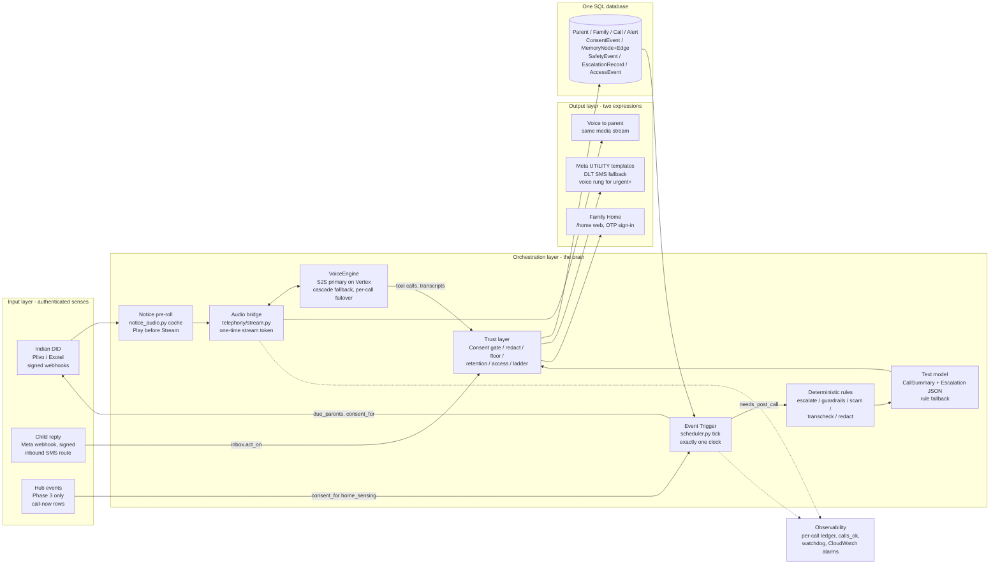

# Meenira "Ubiquitous Brain" — Reviewed and Refined Architecture

## 0. Front matter

| | |
|---|---|
| **Date** | 9 October 2026 |
| **Status** | Draft for founder review |
| **Reference stack** | `/home/user/meenira` at HEAD `19b9fc4` (7 Oct 2026), read-only; production on AWS ap-south-1 since 7 Oct 2026 13:12 IST (`docs/aws-account-<id>-state.md`) |
| **Scope** | The founder's "Ubiquitous Brain" draft, reviewed against the running Meenira stack from seven perspectives (operational, legal and regulatory for India, psychological, necessity, ethical, security and privacy, clinical safety), then refined into a target architecture, deployment plan and phase plan that the current codebase can grow into without a rewrite. |
| **Out of scope** | Pricing strategy, fundraising, marketing copy beyond the sentences the architecture makes true or false, and anything that would require modifying the reference repository in this review. |

**How to read this document.** Section 1 is the ten-line summary. Section 2 reproduces the draft. Section 3 is the review, one table per perspective; every row names the draft box it concerns, its severity, and where in the refined design it is resolved. Sections 4 to 8 are the refined architecture itself; Section 9 is how to deploy it; Section 10 is the order of work; Section 11 lists the decisions only the founder can take. Appendix A maps every draft component to its fate, Appendix B lists every configuration key referenced, Appendix C records the verification status of every non-repo claim.

Conventions. A path such as `meenira/escalate.py` is relative to the repo root. "Today" means the code at HEAD `19b9fc4`. **New** marks a module, field, tool or table that does not exist at HEAD. Rupee and dollar figures are the repo's own approximations unless marked **(est.)**, in which case the arithmetic is ours on top of the repo's figures; no vendor price was independently verified. Every statement about Indian law carries one of three labels: *repo docs* (the founder's own research in `docs/`), *verified via search* (a reviewer checked a secondary legal source), or *training knowledge, unverified*. Nothing has been upgraded from one label to a stronger one in this merge. No secrets, account identifiers or phone numbers appear in this document.

## 1. Executive summary

The draft is the right intent drawn with the wrong parts. It describes a proactive voice brain that senses, thinks, remembers and expresses, which is what `meenira/` already is at about eighty percent (est.), in a shape that has survived incidents the draft has not met yet: a vendor suspension that took voice and sign-in down together, a three-day silent outage behind a green dashboard, a Hindi call transcribed as Portuguese, a fall logged "warn" with no alert reaching the family. The refined design keeps the three-layer picture, relabels each draft box to the module that already does the job, deletes the boxes the repo's own decisions log rejects, draws back in the trust plumbing the draft omits, and adds a bounded set of code changes, each closing a verified finding. Three hard constraints bind every box: at most ₹10 all-in per 3-minute call at pilot and ₹7 at growth; at most one model vendor receives raw audio on any given call, from an approved list of two (the live speech model on Vertex AI as primary, Sarvam STT inside the cascade as the India-resident fallback; telephony carriers excluded by nature); exactly one data store holds parent data.

1. **Telephony (Twilio) — replace.** An Indian DID on domestic CPaaS behind the existing `Telephony` ABC (`meenira/telephony/base.py`): Plivo as pilot primary once `plivo.py` gains `speak()`, `hangup()` and mark support, an Exotel AgentStream adapter as the second route. Twilio survives only for Verify sign-in codes and a possible NRI leg. Today production still dials from a Twilio US number out of the AWS Mumbai box.
2. **WhatsApp (Web.js) — delete.** Replaced by the Meta Cloud API path already coded in `meenira/notify.py` (two UTILITY templates, signed webhook) with a DLT-registered SMS route on a different vendor as the genuinely independent fallback. Web.js is bannable consumer automation on the channel that carries the EMERGENCY alert.
3. **Smart Home (HA) input — defer to Phase 3; Smart Home Action — delete in every phase.** Device events enter only as "place a check-in call" rows for the existing scheduler, under a separate parent-granted consent purpose. A cloud model never actuates anything in an elderly person's home.
4. **Voice Gateway — keep, as built.** `meenira/telephony/stream.py` plus the `VoiceEngine` abstraction, with the audio-to-audio model primary and the Sarvam cascade second. The draft's Audio → STT → LLM → TTS loop is the cascade shape the repo measured and rejected as primary. The one real gap is per-call engine failover; selection is static per process today (`meenira/engine/__init__.py`).
5. **Message Hub — keep, as built.** `notify.py` + `inbox.py` + `/whatsapp/webhook` are the hub. The defect is operational: both live configs have run one channel (`MEENIRA_WHATSAPP=sms`, fallback `sms`), not two.
6. **Event Trigger — keep, hardened.** `meenira/scheduler.py` with its five single-instance guards is the "exactly one clock". Add `failed` to `due_retries`, a database unique index on (parent, local date, attempt), a row-driven post-call work queue, `memory.prune()` in the tick, and a cumulative multi-day safety rule.
7. **Transcription (Deepgram/Whisper) and TTS (ElevenLabs/Azure) — delete as standalone boxes.** Transcription and voice are properties of the engine; a separate vendor is a mid-sentence failure point, another jurisdiction and ₹21–32 per call (repo figure). ElevenLabs survives only as the disclosed familiar-voice experiment flag the decisions log permits.
8. **Intelligence (GPT-4o / second LLM) — replace with one vendor, two pinned roles.** Live speech model for the call, text model for schema-constrained post-call JSON, both behind `meenira/gemini.py`, Vertex AI asserted at startup. Underneath, drawn as its own box: the deterministic rules (`escalate.deterministic_floor`, `guardrails`, `scam`, `redact`, `transcheck`) that produced the alerts the model missed.
9. **Memory Layer (Pinecone + SQL) — replace with the typed graph that exists.** `MemoryNode`/`MemoryEdge` in the one SQL database, written only by tool calls, with sensitivity tiers and a 45-day salience half-life. Pinecone is deleted: an embedding of how a parent describes pain is a transcript archive by another name, an inference, a foreign copy outside erasure, and a source of confabulated memory.
10. **Knowledge Base (RAG over health documents) — delete.** Typed fields only (`Parent.medications`, a conditions picklist, fenced notes). Documents in model context invite the interpretation `MEDICAL_GUARDRAILS` forbids and move the product toward the CDSCO software-as-medical-device line (repo docs; CDSCO draft guidance existence verified via search, finalisation unverified).

Two things the draft does not draw and the refined design makes first-class: a **Trust Layer** that every arrow crosses (Consent & Eligibility Gate, redaction at persistence, Safety Floor, Retention Registry, Access & Audit, Escalation Ladder), and an **Observability** layer that answers "did anyone actually get called this morning?" from outside the process.

## 2. The draft as submitted

Reproduced verbatim from the founder's note, with one exception: the second LLM vendor name in the Intelligence box is shown as `[vendor]` in this committed copy; the founder may restore it. Nothing else is altered.

```
Initial System Architecture

The "Ubiquitous Brain" Framework

[ INPUT LAYER ]               [ ORCHESTRATION LAYER ]              [ OUTPUT LAYER ]
(Senses)                      (The Brain)                           (Expression)
      |                               |                                    |
Telephony (Twilio)  ------>  [ Voice Gateway ]  ------>  TTS (ElevenLabs/Azure)
WhatsApp (Web.js)   ------>  [ Message Hub ]    ------>  Text (WhatsApp/SMS)
Smart Home (HA)     ------>  [ Event Trigger ]  ------>  Smart Home Action
      |                               |                                    |
      v                               v                                    v
[ TRANSCRIPTION ]             [ INTELLIGENCE ]                     [ DELIVERY ]
(STT: Deepgram/Whisper) <---> (LLM: GPT-4o / [vendor]) <---> (Audio Stream / API)
                              |               |
                              v               v
                      [ MEMORY LAYER ] <---> [ KNOWLEDGE BASE ]
                      (Vector DB: Pinecone)   (RAG: User Docs/Health)
                      (SQL: User Profile)

Key Components:
* Voice Gateway: Handles the real-time audio stream, managing the loop: Audio -> STT -> LLM -> TTS -> Audio.
* Memory Layer: A hybrid approach. SQL for "hard facts" (Birthdays, Meds) and Vector DB for "soft context" (The way a user describes their pain, emotional state).
* Event Trigger: A scheduler that allows the bot to be proactive (e.g., "It's 9 AM, time to check on Mother").
```

**The intent, in one paragraph.** One brain that can sense the parent through several channels (telephone today, messaging, later the home itself), think with one model over a hybrid memory of hard facts and soft context, and express itself through voice to the parent, text to the child, and actions in the home, driven proactively by a scheduler rather than waiting to be asked. The review below accepts the intent and the three-layer shape and disputes most of the parts.
## 3. Review findings by perspective

Each table lists the draft component, the finding, its severity after verification, and where the refined design resolves it (section numbers refer to this document). Findings that verification refuted have been removed; findings that verification weakened are stated at their reduced severity. Legal claims carry their source status inline.

### 3.1 Operational

| Component | Finding | Severity | Resolution in the refined design |
|---|---|---|---|
| Memory Layer — Vector DB (Pinecone) | A hosted vector store is a second data store for parent health data outside the retention purge (`meenira/retention.py`), outside the `forget()` cascade, outside export/erasure and Litestream, and on the pre-call briefing path, so a slow or down index either delays dialling or produces a memory-less call. Pinecone's serverless regions do not include India (verified via search). | Critical | Deleted. One data store rule (§4.1, §7). |
| Message Hub — WhatsApp (Web.js) | Consumer-client automation driven from a headless browser on the one channel that carries EMERGENCY; bans are silent and there is no delivery status. It also puts a Chromium process and a QR-linked session file on a burstable box that blue/green-deploys two containers sharing `/data`. | Critical | Deleted; Meta Cloud API path in `notify._meta` plus DLT SMS on a different vendor; statuses webhook consumed (§5.9, §9.3). |
| Telephony (Twilio) as sole sense | Single-account coupling of voice, SMS, consent codes and Verify sign-in is the realised 5 Oct 2026 failure. A Plivo adapter exists (`meenira/telephony/plivo.py`) but has carried no real call and lacks `speak()`, `hangup()` and mark support. | Critical | Two domestic routes behind the ABC; Plivo gains the three overrides before voice codes move; Exotel adapter as route two; egress-identity controls kept as named architecture (§5.1, §9.2). |
| Whole draft — cost per call | Using repo figures, the draft hot path (international leg ₹9 + ElevenLabs ₹21–32 + message ₹1) costs ≥ ₹31–42 per 3-minute call before STT, LLM and Pinecone, against ₹27–38 of revenue per call on the deck's plans. Today's path with SMS as the live channel is closer to ₹36 (est.); the domestic target is ~₹7. | Critical | Cost ceiling as an architectural constraint; per-call cost ledger (§4.1, §8, §9.10). |
| Voice Gateway loop (STT → LLM → TTS) | A three-vendor cascade as primary gives back the measured 0.62/0.68 s first audio (`docs/LATENCY.md`), cannot barge in, and serialises three vendors' latency tails after the 700 ms VAD on every turn. | High | Audio-to-audio primary; cascade second, exercised on ~10% of calls; per-call failover in `make_engine` (§5.3). |
| Whole draft — vendor count | Eight or nine external parties on the call path for a one-founder rota that already missed a three-day outage with two. No runtime failover exists between vendors today. | High | Hot path capped at three vendors (domestic telephony, one voice model, Meta); vendor ledger with pinned ids and rotation dates (§8). |
| Every box — degraded mode | No box in the draft has a defined behaviour when down or slow; the running system's reliability is entirely the deterministic fallbacks the draft omits. `failed` calls are never retried (`meenira/calls.py` line 640 filters `no_answer, deferred`). | High | A degraded-mode line per component in §5; `failed` in `due_retries` with backoff (§5.6). |
| Observability (absent) | The 5–6 Oct outage was invisible for three days while health read green because checks tested reachability, not outcomes. None of the five README alarms exist yet. | High | Observability as a first-class layer; alarms created and recorded (§5.12, §9.8). |
| Data residency across five processors | Five additional external processors each need a written residency answer; most are US-headquartered; only Deepgram offers an India endpoint (verified via search). Today residency is one open question (Vertex, `docs/VISION.md` §6 item 2). DPDP phasing from repo docs. | High | At most one raw-audio model vendor per call from an approved list of two (Vertex live model, Sarvam STT in the cascade); processor register (§4.1, §8). |
| Delivery / hosting | Web.js, Home Assistant, a vector client and a multi-vendor cascade do not fit one container on a t4g.small with a 55 s misfire tolerance and a signal-based drain. | High | Placement rule: code in the one container, a stateless HTTPS/WSS API, or phase-N (§9.1). |
| Knowledge Base — RAG over health documents | A new write path (uploads, OCR, chunking) outside the four redaction choke points and the 30-day purge. | High | Deleted; typed fields only (§7.4). |
| Event Trigger | The draft reduces the most hardened component in the repo to "a scheduler" and would lose five guards, the 15-minute catch-up window and the 55 s misfire grace. | Medium | `scheduler.py` kept verbatim as the Event Trigger with guards drawn (§5.6). |
| TTS (ElevenLabs/Azure) | Not on the live path today; rejected on cost, Indic coverage and residency; a mid-sentence failure point; must cover all 12 configured language codes. | Medium | Removed from primary output; Sarvam Bulbul inside the cascade only (§5.3). |
| Intelligence — two LLM vendors | Doubles tool schemas, prompts, keys and failure classes with no defined switch; model-level safety settings are not configurable on the live endpoint (`meenira/engine/gemini_live.py`), so a vendor change silently changes the safety envelope. | Medium | One vendor, two pinned roles, tested switch procedure (§5.4). |
| Smart Home (HA) and Smart Home Action | A per-home site to support before answer rate is proven; no device code exists; the logged decision is "prove answer rate and willingness to pay before any hardware". | Low | Deleted now; hub events as check-in triggers at Phase 3 (§5.13, §10). |
| Telephony → Voice Gateway edge (added by verifier) | Webhook signing is report-only by default (`MEENIRA_WEBHOOK_AUTH=''`); `/telephony/twilio/inbound` was found publicly reachable and acting on forged requests on the demo box; the signed string carries no timestamp, so a captured `/status` POST replays forever. | High | Enforcement ladder to `all`, idempotent `mark_status`, one-time stream token (§5.1, §8). |
| Pre-session disclosure (added by verifier) | The draft's loop begins at the audio stream; the repo's pre-played notice hides the ~2.5 s connect and makes the legal disclosure independent of the model. The notice cache was not copied at cutover. | Medium | Notice pre-roll as a named component; cache in the restore probe (§5.2, §9.5). |
| Call-outcome state machine (added by verifier) | No no-answer, voicemail or stuck-call semantics in the draft; in the repo `answered_by=machine_start` fired on a human who talked for 76 s. | Medium | Lifecycle drawn under the Event Trigger; AMD advisory once frames arrive (§5.6, §6.1). |
| Post-call delivery as durable work (added by verifier) | Summary, escalation and send run inline in the WebSocket handler after `bridge()` returns (`meenira/calls.py` `finish` → `_notify_checkin`); a crash or deploy in that window loses the child's message; nothing re-sends. | Medium | Row-driven delivery via `needs_post_call` processed by the tick (§5.6, §6.1). |

### 3.2 Legal and regulatory (India)

| Component | Finding | Severity | Resolution in the refined design |
|---|---|---|---|
| Memory Layer — Pinecone "emotional state" | Vectorising how a parent describes pain is an inferred health/psychological profile (crossing the observations-never-inferences line the repo relies on for CDSCO) and an indefinite archive of conversations the consent text says do not exist beyond 30 days. DPDP purpose limitation and erasure duties: training knowledge, unverified. | Critical | Deleted; "no emotional-state store" added to the refuse list (§7). |
| Event Trigger with no consent gate | The parent, not the paying child, is the data principal; DPDP s.9 allows proxy consent only for children and persons with a lawful guardian (verified via search, secondary summaries; DPDP consent sections commence 13/14 May 2027 — sources differ by a day — verified via search). The repo gates dialling on `Parent.consent` (`meenira/calls.py` 108–114) and re-checks on retries; the draft drops both. In-call withdrawal by the parent exists only in design text. | Critical | Consent & Eligibility Gate as a named box; `parent_declines` tool writing `ConsentEvent(actor=parent, granted=False)` server-side (§5.5, §8). |
| Notice to the data principal | The consent script (`meenira/persona.py` 67–120) omits withdrawal, memory persistence, foreign-cloud processing and a grievance contact; `site/content/privacy.md` names no grievance officer, says servers are on Fly.io in Singapore (production moved to AWS Mumbai on 7 Oct), and makes a no-training claim that only Vertex AI can make true (`meenira/gemini.py` selects API-key mode when a key is present). SPDI Rules 2011 r.4, 5(3), 5(7), 5(9): training knowledge, unverified; DPDP Rule 3 at 18 months: verified via search. | High | Consent script gains four sentences in 12 languages; Grievance Officer named; hosting paragraph fixed; `using_vertex()` asserted at startup; claims register test (§8, §9.12). |
| Four to five foreign processors | DPDP s.8(2) contract, s.8(5)–(6) safeguards and breach intimation, s.16 cross-border (training knowledge, unverified; Rule 14 at May 2027 verified via search). Today: one model processor plus Sarvam. | High | Processor admission rule: signed contract, zero-retention in writing, privacy-page row, erasure hook (§8). |
| WhatsApp (Web.js) | Unofficial automation breaches WhatsApp Terms (training knowledge, unverified); urgent alerts on a bannable consumer account; the parent's consent notice cannot go on WhatsApp at all (opt-in is circular, `docs/WHATSAPP_ACTIVATION.md`). | Critical | Meta Cloud API with child opt-in (`Family.wa_optin_at`, **new**) before any send; codes and consent never on WhatsApp (§5.9). |
| Telephony + daily outbound call | TCCCPR Feb 2025 amendment bars commercial communication from ordinary 10-digit numbers for telemarketing and splits 140/1600 series; TRAI's 10 July 2026 clarification confines 1600 to BFSI (both verified via search). Whether a non-telemarketer placing consented service calls must register on DLT: searched, not found. Production dials from a US number; SMS delivered 64% (error 30008, non-DLT signature). | High | Indian DID, DLT PE registration, parent-recorded consent artefact kept as the defence, one CLI per 100–200 parents (§5.1, §9.2). |
| Voice Gateway — recording, notice, audio persistence | India has no private call-recording statute (Telegraph Act s.5(2) governs state interception; Puttaswamy privacy reasoning: training knowledge, unverified); IT Rules amendment in force 20 Feb 2026 (verified via search) makes a spoken AI label prudent. The repo pre-plays the notice and never stores audio; the draft shows neither. | High | Two invariants named: notice-before-stream and audio-never-persisted (§5.2). |
| Knowledge Base — health RAG | CDSCO draft guidance of 21 Oct 2025 (date and SaMD scope verified via search; finalisation unverified) would bring software with a medical purpose under the Medical Device Rules 2017; a document RAG pushes function toward interpretation and monitoring. | Medium | Deleted; structured inputs only (§7.4). |
| TTS vendors and every spoken persona | IT Rules 2026 SGI labelling (verified via search; applicability to a first-party caller unsettled). The screener's first line carries no AI disclosure (`docs/VISION.md` §6 item 8); naming ElevenLabs invites an undisclosed clone. | Medium | One disclosed voice per region; pre-rendered screener label (§5.2, §5.8). |
| Every store — retention, erasure, export | DPDP s.8(7)/s.12 and Rule 8 (training knowledge, unverified; Rule 8 at May 2027 verified via search). `memory.prune` is never invoked; the draft adds five stores with no retention story. | Medium | Retention Registry with a test (§8). |
| Security safeguards and breach runbook | No CloudTrail, IAM admin without MFA, secrets visible to root, no replay protection; breach notices to elderly principals need 12-language templates and a channel that works (SMS 64%, voice 17/17). DPDP s.8(6)/Rule 7: training knowledge, unverified. | Medium | Breach & rights operations in the control register (§8, §9.9). |
| Public claims versus code | Privacy page hosting paragraph stale; test counts stale across three docs; STOP pauses 3 days rather than stopping; terms cap liability at three months' fees (CPA 2019 unfair-term provisions: training knowledge, unverified). | Medium | Claims register; STOP = pause-until-resume with ledger (§8). |
| Smart Home sensing | Continuous home sensing is a different processing purpose needing the parent's own consent; hub certifications TEC/WPC/BIS/EPR (repo docs, unverified). | Medium | Deferred to Phase 3 as `ConsentEvent.purpose='home_sensing'` (§10). |
| Bare LLM between transcription and delivery | No redaction choke points, no deterministic floor, no crisis rule, no output scanner: these are the Aadhaar-storage, CDSCO and duty-of-care defences (Aadhaar Act s.29: training knowledge, unverified). | High | Deterministic Safety Layer as a named box (§5.4). |
| Compliance calendar in `docs/GUARDRAILS.md` | "Consent provisions Nov 2026" misreads Rule 4 (Consent Manager registration at 12 months); Rules 3, 5–16, 22–23 land at 18 months, May 2027 (verified via search against law-firm summaries; exact day unconfirmed). | Low | Calendar corrected; SPDI Rules 2011 named as the baseline until then (§8). |
| SPDI Rules 2011 as the regime that binds today (added by verifier) | Health data is SPDI; Rules 4, 5(1),(3),(7),(9), 6, 7 and 8 bind now (training knowledge, unverified). No grievance officer on the site; no withdrawal sentence in the consent script; each draft processor engages Rule 7 immediately. | High | Grievance Officer; withdrawal sentence; Rule 7 as the processor admission test (§8). |
| Consent artefact and TRAI DCA (added by verifier) | TRAI's 2 June 2023 direction requires consent for commercial communication through the Digital Consent Acquisition facility (127-series) (verified via search; applicability to consented service calls unverified). Meenira's 4-digit code is the DPDP record, not the TRAI record, and goes out on an unregistered route. | High | Two artefacts in the Consent Gate: the parent's code and the DCA reference in `ConsentEvent.note` (§5.5). |
| Foreign-resident payer (added by verifier) | `site/content/for-nri/*` sells to UK, US and Gulf families; UK GDPR Art 3(2)(a) applies to a non-UK controller offering services to UK residents (training knowledge, unverified). | Medium | UK/EU addendum to the privacy page; jurisdiction derived from `child_phone` (§8). |
| Operator access versus the privacy page (added by verifier) | `privacy.md` says operator reviews are limited to safety-flagged calls and logged; `GET /api/calls/{cid}` returns any transcript to any token holder and nothing logs reads. | Medium | `AccessEvent` ledger (**new**) and scoped reads (§5.11, §8). |
### 3.3 Psychological

| Component | Finding | Severity | Resolution in the refined design |
|---|---|---|---|
| Memory Layer — Pinecone "soft context" | Retrieval-by-similarity surfaces the parent's own earlier vulnerability back at her ("last week you said you felt like a burden"), which is experienced as being watched; nearest-neighbour recall makes confabulated memory possible, and one wrong memory ends trust with an elder; an embedded chunk cannot be seen, corrected or deleted. | Critical | Deleted. Mood stays a per-call observation that ages out; durable sensitive facts are listed only as "do not raise" (§7). |
| Voice Gateway + Event Trigger — who controls the call | `app.py` writes `actor="parent"` only for grants; the only parent-actor withdrawal route is the operator typing it after the call. `call_back_later` defers 15–360 minutes and persists nothing, so "stop phoning me" is followed by a retry and a call tomorrow. DPDP s.6(4) withdrawal-as-easy-as-consent: training knowledge, unverified. | High | **New** tool `parent_declines(scope: today\|for_now\|for_good)`; `for_good` confirmed back once before the ledger row is written; `prefer_call_time` as a standing request the child accepts (§5.5). |
| Event Trigger — stopping and pausing | The goodbye promises "tomorrow" unconditionally (wrong for Mon/Wed/Fri parents and before a pause); a child's Stop turns consent off the same second with no farewell; the 2–4 week taper the vision adopted does not exist in code. | High | Schedule-aware goodbye; `Parent.pause_note` (**new**); taper state machine with farewell calls on days 1/7/14 (§5.6, §10 Phase 1). |
| Intelligence + TTS — anthropomorphism | The prompt forbids claiming to be a person but nothing forbids first-person affect ("I was worried about you all night"); `scan_agent_turn` has no category for it; a more human TTS raises the stakes. | High | Prompt rule against stated feelings; `affect_claim`, `guilt`, `false_affection` scan categories (§5.4, §8). |
| Memory Layer — the parent's knowledge of what is kept | The consent scripts never say facts are carried between calls indefinitely; `never_volunteer` is written by nothing; the in-call assent rule ("shall I tell Ravi?") has no prompt line; the summariser receives the whole transcript. | High | **New** `keep_private(topic)` and `forget_this(label)` tools; one consent sentence announcing them; assent rule in the prompt (§5.5, §7). |
| Telephony + opening ritual + consent code | Dialling from a US number trains the parent to answer the exact pattern the product warns about; reading a code aloud to a relative is the habit voice-phishers exploit, though here the child asks, not a stranger. | High | Indian CLI and saved-contact onboarding; consent voice call states the code is for the child only and that Meenira will never ask for one; safe word taught but never stored (§5.1, §8). |
| Voice Gateway — confusion and misidentification | No routine for a parent who repeatedly mistakes Meenira for a relative; no re-consent; marketing claims she "notices confusion in the voice", which the refuse list forbids. | Medium | Prompt routine plus `log_observation(kind=other)`; six-monthly spoken re-consent; marketing line removed (§8). |
| Message Hub — child-planted questions | `inbox.py` records the child as source in the loop detail, but nothing instructs the model to attribute the question, so it is asked as Meenira's own. | Medium | `source='child'` on the node; `callback()` renders mandatory attribution; one child question per call enforced in `_callback_nodes` (§6.4). |
| Output — alert fatigue | A mild notify-level message rides the `meenira_alert` template whose fixed footer reads like an emergency; no quiet hours; mood and engagement are inferences read as verdicts. | Medium | Second UTILITY template `meenira_note` without the footer; `Family.quiet_hours` (**new**) for notify and no-answer only; "sounded low" wording (§5.9). |
| Output — displacement of family contact | Nothing measures whether the daily AI call replaces the child's call; the right metric ("did Ravi call this week?") is named in VISION and absent from `/api/metrics`. | Medium | Weekly conversational question logged as `kind=social`; `family_contact_share` beside answer rate (§8). |
| Smart Home input and action | Radar, pillbox and BLE change the relationship from "she calls me" to "she watches me"; an actuator path lets the child's assistant act in her home. | High | Smart Home Action deleted; sensing deferred as parent-consented triggers with a physical switch and light (§5.13). |
| Intelligence — hostility as clinical data | Anger at being called is indistinguishable from delirium in the current rules (`guardrails.py` CONDUCT_RULES → mood warn → notify), so resistance to the service becomes a reported symptom. | Medium | Two rules: anger at the calls → decline signal; new unprovoked anger → clinical path, against the drift baseline and only after call two (§5.4). |
| Voice Gateway — inbound call from the parent | A parent who rings in gets a full check-in with no daily count; `Call.caller_number` never reaches the summariser. | Medium | One parent-initiated call per day, warm fixed deferral, deterministic `kind=social` observation (§6.2). |
| Memory + callback — bereavement (added by verifier) | `MemoryNode.status` has no deceased state; the graph will keep asking after a dead spouse or grandchild, which `docs/MEMORY.md` §2 calls trust-ending; `forget()` erases the one relationship she most wants to talk about. | High | **New** `MemoryNode.deceased_at`; dependent loops closed; person moved to the never-raise list with warmth wording; `stop_reason='bereavement'` skips the taper (§7). |
| Voice Gateway — hard cut at 240 s (added by verifier) | `stream.py` timer stops the bridge with no wind-down, goodbye or hang-up; the model has no clock. | Medium | Soft limit: `engine.note()` at cap−30 s, hard cut at cap+30 s, pre-synthesised goodbye on a hard cut; cap becomes a Parent field (§5.3). |
| Opening ritual — "recorded" versus "never kept" (added by verifier) | The notice says "this call is recorded"; the consent script says "your voice is never kept"; to a lay elder these contradict, and "recorded" is the register of bank and digital-arrest calls. | Medium | Notice body harmonised to the consent script's own words ("written down… your voice is not kept"), WAVs regenerated; comprehension check with five parents; counsel to confirm (§5.2, §11). |
| No-answer path (added by verifier) | A second ring within the hour, an alert-template message after two attempts and a "Worth a call from you" card teach the parent that declining to pick up costs her son's worry. | Medium | Plain summary-template line unless no-answer runs 2+ mornings; `parent_declines(scope=today)` as a skip; warm "is this a good time?" question (§6.1). |

### 3.4 Necessity

| Component | Finding | Severity | Resolution in the refined design |
|---|---|---|---|
| Telephony (Twilio) | Wrong label: the `Telephony` ABC and the bidirectional bridge already exist; the repo's own verdict is Plivo domestic; telephony is not an input (the same socket carries audio both ways). Regulatory claims: repo docs, unverified. | High | Relabelled "Indian DID via CPaaS", drawn bidirectional (§4.2). |
| WhatsApp (Web.js) | The official route is implemented end to end; WhatsApp is a legitimate input only from the child. The project's own README says unofficial clients may be blocked (verified via fetch). | High | Deleted; effort moved to entity registration, opt-in field, template fixes, statuses, inbound SMS (§5.9). |
| Smart Home (HA) | No code, the pilot parent has an ordinary mobile, and the plan already schedules sensing for the hub as a check-in trigger. | High | Deleted now; Phase 3 hub (§10). |
| Smart Home Action | No counterpart in the product promise (listen, remember, pass on; never arrange or operate); a misheard 8 kHz utterance would actuate. | Medium | Deleted in every phase (§4.1). |
| Voice Gateway | Already built; the draft's loop is `CascadeEngine`, which is turn-based and has never carried traffic; the missing piece is per-call failover. | High | Kept as "VoiceEngine with two implementations" (§5.3). |
| Message Hub | `notify.py` + `inbox.py` + the signed webhook are the hub; no queue or Redis is needed for a few hundred messages a day in one process. | Medium | Kept; channel reality fixed (§5.9). |
| Event Trigger | `scheduler.py` already does more than the draft describes; gaps are `failed` retry and per-parent staleness. | Medium | Kept with two additions (§5.6). |
| Transcription STT | No Deepgram or Whisper code exists; Gemini Live transcribes natively with language hints; benchmarking a second ASR is constrained by "audio never stored". | Medium | Deleted; `transcheck.py` kept as the deterministic language check (§5.3). |
| Intelligence LLM | The product's safety does not live in the LLM: `deterministic_floor` may raise but never lower, `crisis_hit`, `scan_agent_turn`, `scam.heuristic_risk`, `_check_figures`, `redact` and `memory_safe` do the disposing. | Critical | Three boxes: live speech model, text model, deterministic rules (§5.4). |
| TTS (ElevenLabs/Azure) | No code; audio out is native; Sarvam Bulbul covers the cascade; both vendors already rejected. | Medium | Deleted (§4.1). |
| Vector DB (Pinecone) | Rejected three times over in `docs/MEMORY.md` and `docs/VISION.md`; the need is met by `log_observation`, `health_thread` nodes, sensitivity, confidence and salience. | Critical | Deleted (§7). |
| SQL User Profile | Already built and richer than described; SQLite with Litestream is right through the few-hundred-parent proof. | Low | Kept; festival/birthday as a node kind (§7). |
| Knowledge Base RAG | Nothing exists; the prompt forbids interpreting reports; the compliant shape is structured, family-entered or ABHA-sourced facts, never a document index. CDSCO: repo docs, unverified. | High | Deleted; structured minimum kept (§7.4). |
| Missing trust layer | No consent gate, disclosure, redaction, purge, export/erase or safety ledger in the drawing; all are load-bearing in the repo. | Critical | Trust Layer drawn as the middle box every arrow crosses (§4.2). |
| Overall framing | Nine input/output paths for a product with two, maintained by one person; the week-8 gate has not been passed. | High | Three boxes plus the trust layer, with a written "deleted or deferred" list (§4, Appendix A). |
| Family Home (added by verifier) | The draft's child side is a text message; corrections, acknowledgement, pause and deletion have nowhere to land without the web Home (`tests/test_home.py`). | High | Family Home drawn as the second child-side output (§5.10). |
| Inbound screening (added by verifier) | A built and publicly promised input path (`calls.start_screen`, `/telephony/{provider}/inbound`) carries zero traffic: the Twilio number's console URLs point at demo pages. | Medium | Decision required before it carries traffic (§11 item 9). |
| Per-call cost gate (added by verifier) | Deck budgets ₹15 all-in against ₹27–38 revenue per call; ElevenLabs alone would consume the daily plan's revenue. | High | Cost ceiling and per-box cost (§4.1, §9.10). |
| Observability and alarm path (added by verifier) | No "did anyone get called?" component; the README's alarm table says nothing alarms until created; SES is sandboxed. | High | Health component with a Twilio-independent notification path (§5.12). |
### 3.5 Ethical

| Component | Finding | Severity | Resolution in the refined design |
|---|---|---|---|
| Event Trigger and Orchestration | No consent layer: the payer schedules calls to a data subject who never agreed. The repo gates on `Parent.consent` and the `ConsentEvent` ledger; the draft drops both. DPDP s.9 / r.10 scope: verified via search (secondary summaries); TCCCPR: repo docs. | Critical | Consent Gate + ledger as a box; `consent_for(parent, purpose)` (**new**) as the single function every trigger source calls; CI test that a `granted=False` latest row cannot be dialled (§5.5). |
| Voice Gateway tool set | The parent has no in-call way to switch Meenira off; `CHECKIN_TOOLS` has no decline tool; the website says the choice is hers. | High | `parent_declines` with a deterministic phrase twin like `crisis_hit`; re-consent only via the parent's code (§5.5). |
| Intelligence → Text to the child | Dual loyalty unresolved: everything confided flows to the child; the promised in-call assent rule is unimplemented; the summariser receives the full transcript. | High | `keep_private` spans masked for the summariser and the family call page; override only when the floor ≥ urgent or `crisis_hit` fires, disclosed up front; "what did you tell Ravi yesterday?" readback (§5.5, §7). |
| Memory — Pinecone | A shadow transcript archive and an inferred profile the company has told families it will not keep; memory the parent cannot see or erase item by item. | Critical | Deleted; `memory.prune()` scheduled (§7). |
| Knowledge Base RAG and secondary uses | Health documents in context exceed the consent given; the roadmap's "IndicConformer fine-tuned on the pilot's elderly-speech corpus" describes a corpus that cannot lawfully exist while "voice never kept" is promised to everyone. | High | Purpose-bound readers; any new consumer needs its own `ConsentEvent.purpose`; corpus line struck until an opt-in research consent exists (§7, §10 Phase 3). |
| Intelligence as sole judge of urgency | The LLM alone cannot decide whether a fall reaches the family; eight failed calls produced no alert while children believed their parents were being checked on. | Critical | Deterministic Safety Floor; "failure honesty" message when a call could not be placed; monthly announced drill (§5.4, §5.7). |
| TTS and the absence of a disclosure component | No disclosure step in the draft; the named vendors offer cloning as a feature; the notice says "recorded" while no audio is stored. IT Rules amendment dates verified via search; applicability to a first-party agent is our reading. | High | Disclosure pre-roll that fails closed for check-ins; code-enforced voice allow-list; harmonised sentence (§5.2). |
| Transcription and single LLM across 12 languages | Safety is not language-fair: crisis lists Hindi/English, scam heuristics English/Hindi, floor English/Hindi/Odia; nine voice scripts not native-reviewed. Whisper/Deepgram Indic coverage: training knowledge, unverified. | High | Per-language safety parity gate: a language is sold only when its term lists, scripts, ASR measurement and two scripted scenarios pass (§5.4, §10). |
| Persona as the "answer-rate engine" | A warm daily voice to an isolated elder is a persuasive system; engagement is a diagnostic today and nothing stops it being wired into scheduling or salience; the taper exists only as policy text. | Medium | Guard test that scheduler and briefing never import engagement; hard caps in code; taper as scheduler state (§8). |
| Smart Home sensing and actuation | Surveillance unless the parent owns the switch; a cloud model acting in an elder's home is a new class of harm. | High | Deleted for the pilot; six written controls at hub phase (§5.13). |
| Text as the only crisis path | No human handoff: the emergency alert is one message to a child who, for the target market, is often asleep at 08:30 IST; `Telephony.speak` exists but reads only sign-in codes. | High | Escalation Ladder with four rungs: voice call to the child, second contact, offer to connect to Tele-MANAS/Elderline on spoken assent, stay-on-the-line (§5.7). |
| SQL profile and the parent's side | The parent cannot see what is held about her or what was said about her; only the child or operator can invoke `forget()`. | Medium | Voice-first data rights: `forget_this`, `what_do_you_know`; first-call readback of the child's notes and conditions (§5.5). |
| WhatsApp (Web.js) and Twilio as drawn | Unofficial automation and a foreign caller ID undermine the honesty the AI label is meant to buy; on Fly there was one channel, and the post-cutover AWS value is not recorded. | Medium | Meta path, independent SMS, Indian CLI, saved contact (§5.9). |
| Orchestration without governance boxes | Three of the promises (audio never kept, transcripts 30 days, export on request) are met by modules the draft omits. The fourth, "stop deletes the notes" (`privacy.md`, `questions.md`, `CONTENT.md`, the Home button), is currently false in code: the family `stop_calls` route only withdraws consent and deletes nothing; only the operator `erase_data` route erases (`web/app.py`). | Medium | Data governance gates in the Trust Layer; stop/erase reconciled before the first paid month (C28, §9.12); backup window stated honestly (§8). |
| Family call page versus the parent's notice (added by verifier) | The child reads every verbatim turn for 30 days (`app.py` 820–846); the parent was told only that the child will be "told how you are". | High | Family view defaults to summary, observations and escalation; verbatim turns only when level ≥ notify or with in-call assent; `[kept private]` spans masked (§5.10, §11). |
| Child-planted questions (added by verifier) | A child's "ask her whether…" is asked as Meenira's own curiosity; `CONTENT.md` promises nothing is hidden from the parent. | Medium | Mandatory attribution; scam/financial-shaped questions refused and the child told; the inbox reply shows the exact sentence (§6.4). |
| Operator desk (added by verifier) | Human review of transcripts and crisis excerpts is undisclosed to the parent and unaudited; one shared bearer token accepts two legacy header names and is skipped when unset. | Medium | One disclosure sentence; `AccessEvent` on every read; per-operator identities via the admin session; `SafetyEvent.detail` trimmed (§5.11). |
| Hostility-as-clinical-data asymmetry (added by verifier) | A parent's angry refusal becomes a warn mood observation, a notify alert and a conduct row, with no path to record it as a "no". | Medium | Separate refusal from hostility; apply the clinical rule only against baseline after call two (§5.4). |

### 3.6 Security and privacy

| Component | Finding | Severity | Resolution in the refined design |
|---|---|---|---|
| Memory — Pinecone | Embedding inversion recovers short inputs near-verbatim (verified via search), so a vector store is a transcript archive by another name; deletion from a managed index is by id and best-effort; replicas and provider backups keep copies. | Critical | Deleted; standing rule "no derived representation of a transcript may outlive the transcript" (§7). |
| Message Hub — Web.js | The auth-state folder is the account: anyone who copies it from the box or a backup can read every family's alerts, send as Meenira, and issue inbox commands that pause calls or delete memory; the credential cannot be rotated without re-pairing a phone. | Critical | Meta Cloud API; webhook fails closed when `META_WA_APP_SECRET` is unset in production; System User token in SSM (§5.9). |
| Smart Home Action and HA input | An actuator reachable from the conversational loop turns spoken prompt injection into physical action; HA long-lived tokens are effectively all-or-nothing (training knowledge, unverified); occupancy data is the surveillance the refuse list forbids. | Critical | Deleted in every phase; inputs deferred as deterministic read-only triggers (§5.13). |
| Telephony webhooks | Routes are public with a sequential integer `call_id`; signing is report-only; exceptions on enforced routes allow; a forged `/inbound` creates a Call row that suppresses the real morning call; `/ws` is gated only on terminal state and `LiveCall.run` does not refuse a second socket. | High | Enforcement ladder to `all`, exception = refuse, monotonic `mark_status`, unguessable per-call token, one-time stream token, browser-mic and simulator moved to an operator route (§5.1). |
| Cross-border data flows | Raw audio to a US STT vendor, text to a US LLM, output to a US TTS, embeddings to a US vector SaaS: four DPAs and four breach surfaces where today there is one. DPDP Rules timeline verified via search; s.16 mechanism training knowledge. Production Gemini auth mode not determinable from the repo. | High | At most one model vendor receives raw audio per call, from an approved list of two (Vertex live model; Sarvam STT in the cascade); processor register in `docs/` (§4.1, §8). |
| Identity for the child | Phone number end to end: `SESSION_SECRET` falls back to `OPERATOR_TOKEN` then `dev-insecure` (`meenira/config.py`); admin is granted by phone list alone; inbox commands are authenticated by the last 10 digits of the sender. | High | Fail closed on missing secrets at startup; three distinct secrets; second factor and short sessions for admin; confirmation or signed-in Home for destructive inbox commands (§8). |
| Knowledge Base and Memory — insider access | One shared operator token, skipped if unset; no read-audit ledger; `forget()` leaves no tombstone. | High | `AccessEvent` ledger surfaced on Home as "who has looked at your mornings"; content-free tombstone on forget (§5.11). |
| Prompt injection | The family-note fence is sound; retrieved documents would be an unfenced channel; `log_observation` accepts any `kind`/`severity` string and an unknown severity ranks 0. | High | No document RAG; server-side enum validation with a test that an out-of-enum severity cannot lower a floor (§5.4). |
| TTS and persona impersonation | The success condition ("Ravi's assistant" is answered) is the scam pretext; a cloning-capable vendor on the default path lowers impersonation cost; the safe word exists only in docs. | Medium | One fixed disclosed voice; safe word never stored in Meenira; `scam.py` pattern for "a caller claimed to be Meenira" (§8). |
| Redaction placement | A text hop would be the one shape where pre-LLM redaction is possible, but it also adds unguarded sinks (vector DB, TTS echo, RAG). Digits spoken as words are not caught. | Medium | Redaction as an explicit stage before any write and before text leaves to any vendor other than the live voice model; spelled-out digit sequences added (§8). |
| Secrets handling | `OPERATOR_TOKEN` doubles as session fallback and demo signing key; an identifier sits in `fly.prod.toml` `[env]` (low sensitivity); `docker --env-file` exposes values to root; no CloudTrail; IAM admin without MFA. | Medium | One secret per role; read-only tmpfs bind; CloudTrail, MFA, EBS encryption default; secrets inventory (§9.4). |
| Intelligence — vendor breach blast radius | Every call ships the briefing including the never-volunteer labels; model-level safety is not configurable; the developer free tier is governed by different data-use terms (training knowledge, unverified). | Medium | Vertex asserted; never-volunteer sent as a count plus coarse category, not labels (§5.4, §7). |
| Event Trigger | A proactive scheduler that can double-dial is a harassment and UCC-liability engine; the draft adds HA events as a second trigger source with no idempotency. | Medium | Partial unique index on (parent_id, local_call_date, attempt) for `kind='checkin' AND status != 'failed'`; one gate function and a per-parent daily budget for every source (§5.6). |
| Compliance posture | DPDP timeline slightly wrong in `docs/GUARDRAILS.md` (verified via search). | Low | Corrected; Compliance & Privacy box names its artefacts (§8). |
| Backups and the 30-day promise (added by verifier) | A day-29 nightly backup expires ~day 64; Litestream keeps 720 h; erasure never reaches S3; a restore would resurrect purged transcripts and erased parents. | Medium | Backup grace window stated; retention shortened to 30 + 14; restore runbook replays the purge and every withdrawal (§9.5). |
| Data-principal notice versus the child's access (added by verifier) | The notice under-describes the processing: the child reads every turn and can export everything. Legal basis: repo's DPDP reading. | Medium | Summary-only family view (chosen in §11) (§5.10). |
| Parallel media WebSocket (added by verifier) | A second socket on a guessable in-progress id runs a parallel model session that can poison memory and send the child a forged EMERGENCY. | High | One-time stream token bound to the Call row; second socket refused; `finish()` writes only for the token holder (§5.1). |
| Public `/api/health` (added by verifier) | Discloses `sockets_held` (a parent is on a call right now), engine, telephony, auth mode. | Low | Minimal public probe; detailed variant on 127.0.0.1 or the operator token (§5.12). |

### 3.7 Clinical safety

| Component | Finding | Severity | Resolution in the refined design |
|---|---|---|---|
| Voice Gateway loop and Intelligence | Purely model-driven; the repo learned that a deterministic floor must sit under the model ("the model proposes, deterministic rules dispose"). | Critical | Safety Floor as a fourth box between Intelligence and Delivery, pure Python, no vendor; term tables under change control (§5.4). |
| Safety Floor as carried forward | Blind in 8 of 12 languages (`_EMERGENCY`, `_URGENT`, `_SELF_REPORTED`, `_ALONE` in `meenira/escalate.py` cover EN/HI/OD); "fell" is scoped, so "I fell and cannot get up" with nothing logged yields `none` (verified by executing the functions). | Critical | Per-language tables as a release gate; unscoped pronoun-bound "fall + cannot get up" group (§5.4). |
| Unscoped emergency keywords | Bare substring matching fires EMERGENCY on "no trouble breathing", heartburn, a neighbour's stroke last year. | High | Bounded-window negation and third-person qualifiers downgrade to urgent, never suppress; floor hits logged as `SafetyEvent kind='floor'` for precision measurement (§5.4). |
| Delivery for urgent and emergency | One post-call SMS to one phone on a channel measured at 64% delivery; no voice call, second contact, acknowledgement timer or re-send. | Critical | Escalation Ladder state machine with `Parent.second_contact` (**new**) and operator page; monthly drill (§5.7). |
| Loop timing and post-call processing | Alerts fire only after the call ends; an in-call `urgent` tool call triggers nothing; a crash between hang-up and the post-call pass loses the escalation; `_worth_telling` skips deferred calls. | High | Real-time floor at `LiveCall.on_transcript`; `needs_post_call` row re-run by the tick; floor always runs on deferred calls; the model releases the line within one turn on emergency (§6.1, §6.3). |
| Vendor dependence of the emergency path | In-call behaviour is prompt-only inside one vendor whose filters cannot be configured; per-call failover is a safety control only once the cascade is proven. | High | No-single-vendor rule; safety suites gate every model or prompt change; daily per-vendor canary (§5.3, §8). |
| Knowledge Base — Health RAG | Tempts the model into interpreting reports, diagnosing and dosing; CDSCO SaMD territory (verified via search, secondary). | Critical | Deleted; structured facts only (§7.4). |
| Memory — "soft context" vectors | An inferred clinical profile and a transcript archive; a fabricated symptom history read back in her warm voice. | High | Typed graph with a verbatim quote inside `health_thread.detail` the parent can see (§7). |
| SQL meds + proactive trigger | Medication facts plus a daily question drift into reminders; the list is free text with no doctor source, review date or removal path; `medications_taken` is an adherence metric. | High | "Ask, never remind" as a hard rule; provenance and monthly family confirmation; a parent's "the doctor stopped it" suppresses the question until the family confirms (§7.4). |
| Crisis path | `crisis_hit` knows Hindi and English only; Elderline is 8 AM–8 PM and Tele-MANAS 24x7 (both verified via search); follow-up is structural only if the model logs a health observation. | High | Lists per language under the gate; time-aware helpline block; crisis `SafetyEvent` routed to the ladder; operator sign-off within 24 h (§5.7). |
| No-answer, failed and stuck calls | `failed` never retried; AMD mapping fired on a human; pipeline health is global. | Medium | No-answer ladder; AMD advisory once `frames_in > 50`; per-parent days-since-reached (§5.6, §5.12). |
| Smart Home sensor-to-actuator loop | An alarm and a physical action, both refused or deferred by the decisions log. | Medium | Deferred to hub as check-in triggers only (§5.13). |
| Observation versus diagnosis boundary | The said/observed rule VISION says is "encoded in the summarize schema" is not in `meenira/summarize.py`; the output scanner is post-call, Hindi/English, keyword-based. | Medium | Rule moved into the summarize prompt with a deterministic post-check mirroring `escalate._check_figures` (§5.4). |
| Evidence under 30-day retention | The purge destroys the provenance inside `Call.escalation` (floor level, model level, signals); outcome fields on Alert and SafetyEvent survive. | Low | **New** `EscalationRecord`, transcript-free, exempt from the purge (§5.7). |
| Human roles and the safety case | The draft names no humans; the stack has the child on SMS and an operator with a queue but no SLA, on-call, second contact or clinical reviewer. | High | Roles with response times; hazard log H1–H10; change control; ISO 14971 / DCB0129-style structure as templates only (training knowledge, unverified; not Indian obligations) (§8). |
| CONDITION_NOTES / dietary_note (added by verifier) | Templated advice is attributed to "their doctor" on the strength of a family-typed keyword; `parse_conditions` matches substrings, so "heartburn" yields a heart condition and "kidney stones" the kidney salt-and-fluids note (verified by running the function). | Medium | Fixed picklist on whole tokens; "{child} told me the doctor asked…"; regression tests (§7.4). |
| Multi-day decline (added by verifier) | Three mornings of "haven't eaten much" logged `info` return `none` each day; the reasoning prompt is told to habituate; drift never sends a message. | High | Cumulative deterministic rule in the tick: `ate=False` two mornings → notify, three → urgent; a warn health thread three mornings running → urgent (§5.6). |
| Transcription quality as a safety dependency (added by verifier) | The floor reads the vendor's transcript; `asr_flag` has no safety consequence; a call with audio and zero parent turns is silent. | Medium | `asr_flagged` or audio-without-turns floors at notify with a fixed line and a `SafetyEvent kind='asr'`; per-language accuracy in the release gate (§5.4). |
| Speaker identity (added by verifier) | Everything inbound is labelled `parent`; a neighbour's chest pain fires the floor about the parent; a proxy's "she is fine" becomes self-report. | Medium | **New** tool `someone_else_answered(who, relation)` → `Call.answered_by`; third-party floor mode; drift excludes the call (§5.4). |
## 4. Refined architecture

### 4.1 Thesis

The Ubiquitous Brain intent is right: one brain that senses through the phone today and through a hub in the parent's home later, and expresses itself only as a voice to the parent and a message to the child. The draft's boxes are a generic US voice-bot kit. The end-state that survives the verified findings keeps the draft's three layers and makes the middle layer two things, not one: a *model* that proposes and a *deterministic trust layer* that disposes (consent gate, notice-before-stream, redaction at persistence, safety floor, escalation ladder, retention registry, access and audit). Everything new is earned in order: close the verified defects first, then domestic telephony and Meta messaging (cost and compliance), then per-call engine failover, then the hub and self-hosted Indic models only after the week-8 gate and a certification budget.

Three hard constraints bind every box, and a box that cannot meet them is not drawn:

1. **Cost.** At most ₹10 all-in per 3-minute call at pilot and ₹7 at growth, measured by a per-call cost ledger rather than assumed. The draft's hot path is ≥ ₹31–42 per call before STT, LLM and Pinecone are priced, against ₹27–38 of revenue per call (repo figures, approximate; arithmetic ours).
2. **At most one model vendor receives raw audio on any given call, from an approved list of two.** The live speech model on Vertex AI is primary (written residency answer on file before the first paid month); Sarvam STT inside `CascadeEngine` (`meenira/engine/cascade.py` POSTs the parent's audio to `/speech-to-text`) is the India-resident fallback. A call runs on one engine or the other, never both. Telephony carriers (Plivo, Exotel, Twilio) carry the audio by definition and are excluded from the count. Any third name requires the C26 admission test.
3. **One data store for parent data.** SQLite with Litestream now, Postgres when a second writer process genuinely exists; every store that holds anything derived from a parent's words is in it, so the retention purge, the `forget()` cascade, export, erasure and backup cover it automatically.

Two outputs only: voice to the parent on the same media stream, and a message plus the Family Home to the child. Meenira never actuates anything in the home and never touches money.

### 4.2 Corrected three-layer diagram

```
[ INPUT LAYER ]                  [ ORCHESTRATION LAYER ]                    [ OUTPUT LAYER ]
(Senses, all authenticated)      (The Brain = model + deterministic rules)   (Expression, two kinds only)
      |                                     |                                        |
Indian DID, two CPaaS routes <==> [ Call Loop ]                     ------> Voice to parent (same stream)
 (Plivo now / Exotel hedge /       notice <Play> -> audio bridge ->            one disclosed voice per region
  SIP trunks at >=5k)              VoiceEngine (S2S primary,
  signed webhooks, call-state      cascade fallback, per-call failover)
  gate, one-time stream token              |
      |                                    v
Child reply (Meta webhook,  ---> [ TRUST LAYER — every arrow crosses it ]
 signed; rule-first parser;        Consent & Eligibility Gate (ConsentEvent ledger, pause, duplicate guard)
 inbound SMS route, new)           Redaction at persistence (4 choke points) | Safety Floor (model may raise, never lower)
      |                            Retention Registry (30 d content, 365 d facts, backups 30+14)
Hub events (Phase 3 only)   --->   Access & Audit ledger | Escalation Ladder state machine
 (button / radar / BLE /                   |
  pillbox) -> "call now" rows              v
                                 [ EVENT TRIGGER = exactly one clock ]
                                   APScheduler tick: due parents, retries (incl. failed),
                                   needs_post_call queue, purge, prune, multi-day rule
                                           |
                 +-------------------------+-------------------------+
                 v                                                   v
      [ INTELLIGENCE ]                                     [ DELIVERY ]
      Live S2S model (the call)                            Meta WhatsApp UTILITY templates to the CHILD
      Text model (schema JSON summary + escalation)        DLT SMS (independent vendor) as fallback
      Deterministic rules: floor, crisis, scam ratchet,    Voice call to child / second contact (urgent+)
      figure check, output scan, transcheck, redact        Family Home (web, OTP; corrections, ack, stop)
                 |
                 v
      [ MEMORY = one SQL database ]  (SQLite + Litestream now; Postgres when a 2nd writer exists)
      Parent/Family/Call/Alert | ConsentEvent (append-only) | MemoryNode + MemoryEdge typed graph
      SafetyEvent / EscalationRecord / AccessEvent ledgers | NO vector DB, NO document RAG

      [ OBSERVABILITY — first-class ]  per-call ledger (first_audio_s, engine, cost), calls_ok + per-parent
      staleness, host watchdog -> CloudWatch alarms, per-vendor canary, Twilio-independent alert path
```

### 4.3 Mermaid flowchart



### 4.4 Component catalogue

| Component | Role | Technology | Existing module or new | Replaces in draft | Phase |
|---|---|---|---|---|---|
| Domestic telephony | Dial and answer the parent from an Indian number; media stream | Plivo Indian DID; Exotel AgentStream second route; direct SIP into Jambonz/LiveKit at ≥5k parents | `meenira/telephony/{base,plivo,twilio,signature}.py`; **new** `telephony/exotel.py`; **new** `speak`/`hangup`/`mark_frame` on `plivo.py` | Telephony (Twilio) | 0b–2 |
| Notice pre-roll | Spoken AI and "written down" disclosure before any model is attached | Cached per-parent WAV via `<Play>` before `<Connect><Stream>`; fails open to 0.3 s silence | `meenira/notice_audio.py`; `telephony/twilio.py answer_xml` | absent | exists |
| Audio bridge | mu-law 8 kHz ↔ PCM16, barge-in, goodbye mark, cap | `stream.bridge()` with **new** one-time token check and soft wind-down at cap−30 s | `meenira/telephony/stream.py`, `meenira/audio.py` | Voice Gateway | exists + 1 |
| VoiceEngine | The conversation | Speech-to-speech model (pinned id) primary; `CascadeEngine` (Sarvam saarika/bulbul) fallback on ~10% of calls; **new** per-call failover in `make_engine` | `meenira/engine/{base,gemini_live,cascade,__init__}.py` | STT → LLM → TTS chain | exists + 1 |
| Text model | Post-call `CallSummary` and `Escalation` JSON with rule fallback | Same vendor as the live model, pinned id, schema-constrained | `meenira/summarize.py`, `meenira/escalate.py`, `meenira/gemini.py` | "LLM: GPT-4o / second vendor" | exists |
| Deterministic rules | Dispose what the model proposes | Floor, crisis and conduct scans, scam ratchet, figure check, output scan, transcript-language check, redaction | `escalate.py`, `guardrails.py`, `scam.py`, `redact.py`, `transcheck.py` | absent | exists + 1 |
| Consent & Eligibility Gate | Only the parent's own consent dials | `Parent.consent` + purpose-scoped `ConsentEvent`; **new** `consent_for(parent, purpose)`; **new** `parent_declines` tool | `meenira/calls.py start_checkin`, `due_retries`; `models.ConsentEvent` | Event Trigger fires on time alone | exists + 0a |
| Event Trigger | Exactly one clock | In-process APScheduler with five guards; **new** DB unique index, `failed` retry, `needs_post_call` queue, `prune`, multi-day rule | `meenira/scheduler.py`, `calls.py` | "a scheduler" | exists + 0a |
| Memory | What she remembers | `MemoryNode`/`MemoryEdge` typed graph, tool-written; **new** `deceased_at`, `source`, `keep_private`, `forget_this` | `meenira/memory.py`, `models.py` | Pinecone + SQL profile | exists + 1 |
| Knowledge | Family-typed structured facts | `Parent.medications`, `Parent.conditions` as a picklist (**new**), fenced notes | `models.Parent`, `guardrails.py CONDITION_NOTES`, `persona.identity_block` | RAG: User Docs/Health | exists + 1 |
| Child channel | Summary, alerts, replies | Meta Cloud API UTILITY templates + DLT SMS on a different vendor + statuses webhook; rule-first parser; **new** inbound SMS route, `Family.wa_optin_at`, `meenira_note` template | `meenira/notify.py`, `meenira/inbox.py`, `web/app.py /whatsapp/webhook` | WhatsApp (Web.js), Message Hub, Text | exists + 0b |
| Escalation Ladder | Make urgent+ reach a human | **New** state machine over `Alert` rows: SMS + WhatsApp + voice (`Telephony.speak`) → second contact → operator page; `EscalationRecord` | **new** `meenira/ladder.py`; `models.Alert`; **new** `Parent.second_contact_*` | Delivery | 0a–1 |
| Family Home | Where corrections, acknowledgement, pause and stop live | Existing `/home` with **new** access log view, quiet hours, summary-only call page | `web/app.py /api/my/*`, `drift.py`, `tests/test_home.py` | absent | exists + 1 |
| Access & Audit | Who read what | **New** `AccessEvent` ledger on every operator read, export, erasure; per-operator identity | **new** table in `models.py`; `web/app.py operator()` | absent | 0a |
| Observability | "Did anyone get called?" | Per-call ledger with cost, per-parent staleness, host watchdog → CloudWatch alarms, Twilio-independent alert path | `meenira/pipeline_health.py`, `deploy/aws-ec2/watchdog.sh`, `meenira-alert@.service` | absent | 0a |
| Hub | Own the MSISDN; local wake-word/VAD/AEC; buttons; radar and BLE as triggers | ESP32-S3 or QCM2290, LTE Cat-1bis VoLTE, no camera (repo docs) | **new** firmware and a signed event endpoint feeding `calls.start_checkin(reason)` | Smart Home (HA) + Smart Home Action | 3 |
## 5. Detailed component specifications

Each subsection gives responsibility, interfaces (with the configuration keys from `.env.example` where they exist), failure behaviour, limits, and the repo module it maps to or the new module to write. Figures are repo measurements unless marked (est.).

### 5.1 Domestic telephony

**Responsibility.** Place the morning call from an Indian number, answer with the notice and the media stream, report call status, and (for the screener) accept inbound calls. Carry audio both ways on one WebSocket. Authenticate every webhook.

**Interfaces.** `Telephony` ABC (`meenira/telephony/base.py`): `place_call(to, call_id)`, `answer_xml(call_id, after_url, notice_url)`, `hangup_xml`, `speak(to, twiml)`, `hangup(provider_call_id)`, `parse_frame`, `audio_frame`, `clear_frame`, `mark_frame`, `status_from_callback`. Routes: `/telephony/{provider}/answer|notice|status|inbound|after-screen`, WebSocket `/ws/{provider}/{call_id}`. Config: `MEENIRA_TELEPHONY` (twilio | plivo; **new** exotel), `MEENIRA_CALLER_ID`, `MEENIRA_PUBLIC_URL` (the signed URL is rebuilt from it because the proxy terminates TLS), `TWILIO_ACCOUNT_SID`, `TWILIO_AUTH_TOKEN`, `TWILIO_AUTH_TOKEN_PREV` (rotation window), `PLIVO_AUTH_ID`, `PLIVO_AUTH_TOKEN`, `MEENIRA_WEBHOOK_AUTH` ('' report-only, off, all, or a route subset), `MEENIRA_AMD`, `MEENIRA_AMD_SPEECH_MS` (4000 ms; Twilio's 2400 ms default misreads an elderly "hello? hello?" as voicemail).

**Failure behaviour.** Provider API error at `place_call` → Call marked `failed`, `SystemEvent('telephony')`; **new**: `failed` enters `due_retries` with a per-day cap and backoff so a provider outage retries instead of dropping the day. Provider restriction (the 5 Oct pattern) → `pipeline_health.consecutive_failures` trips `calls_ok` and the host watchdog publishes a zero. Signature verification exception → today allows the request; **new**: on an enforced route an exception refuses. A refused genuine callback is a missed morning (Twilio does not retry voice callbacks), which is why enforcement walks a ladder: three `verdict=match` per route, `status` first, `answer` last.

**New controls.** (a) One-time stream token per call passed as a `<Parameter>` and bound to the Call row; `/ws` refuses a second socket while one is held; `finish()` writes only for the token holder. (b) Monotonic `mark_status`: terminal states never regress; a repeated (CallSid, CallStatus) pair within the call's lifetime is ignored, which removes most replay exposure without a vendor change. (c) Unguessable per-call token in callback URLs in place of the sequential integer. (d) Browser-mic page, simulator and scripts move to an operator-authenticated WebSocket route so the production route can enforce. (e) `plivo.py` gains `speak()`, `hangup()` and `mark_frame()`; until then voice-delivered codes and the confirmed goodbye stay on Twilio. (f) **New** `telephony/exotel.py` against the same bridge (VISION estimates ~1 day).

**Limits.** Twilio Media Streams regions are US1/IE1/AU1 only (repo docs, `docs/aws-cutover-runbook.md`, not independently verified); the Indian leg must be domestic to remove the international hop `docs/LATENCY.md` identified. One CLI per 100–200 parents, saved-contact onboarding and DLT Principal Entity registration are owner tasks, not code (repo docs). Toll-bypass rule: never bridge an Indian PSTN call to an international voice leg; streaming media to a cloud model is processing, not interconnection (repo docs, unverified).

### 5.2 Notice pre-roll

**Responsibility.** Speak the AI and recording disclosure in the parent's language the instant the call connects, independent of any model being up, and hide the ~2.5 s live-session connect behind it.

**Interfaces.** `meenira/notice_audio.py`: per-parent 24 kHz 16-bit WAV at `DATA_DIR/notice_audio/{parent_id}.wav`, synthesised once (hardcoded TTS model, four retries), warmed at consent verification and lazily on any `/answer` with no cache; served by `/telephony/{provider}/notice`, which returns 0.3 s of silence rather than 404 because a failed `<Play>` fetch can end the call. `persona.RECORDING_NOTICE` per language; `NOTICE_DELIVERED` and `NOTICE_PENDING` cues tell the model whether to repeat it. Config: `GEMINI_VOICE`, `MEENIRA_DATA_DIR`.

**Failure behaviour.** Missing cache → old behaviour, the model speaks the notice (call 41 on AWS logged "TTS returned no audio" and fell back to the carrier voice because `/data/notice_audio` was not copied at cutover). **New**: for check-in calls the disclosure fails closed — if neither the cache nor the model has delivered it, the prompt requires it before anything else, and a test asserts it. The screener gets a pre-rendered first sentence ("I am {child}'s AI assistant answering for {parent}").

**Wording.** Harmonised to the consent script's own words: "I'm Meenira, {child}'s AI assistant. What we say is written down so I can tell them how you are; your voice is not kept." One template per language; WAVs regenerated on change; a five-parent comprehension check before and after. Whether "written down" satisfies the notice reading in `docs/GUARDRAILS.md` is for counsel (§11).

**Limits.** The notice cache is part of the data set: `backup.sh` tars it; **new** it enters the restore probe and `/api/health` reports how many consenting parents lack a cached notice.

### 5.3 Audio bridge and VoiceEngine

**Responsibility.** Run the conversation: provider frames → engine audio → provider frames, with barge-in, tool-call routing, a confirmed goodbye and a cap.

**Interfaces.** `stream.bridge(ws, provider, engine, on_transcript, on_tool_call, max_seconds, on_turn_end)` → stats `{frames_in, frames_out, ended_by, first_audio_s, goodbye, seconds}`. `VoiceEngine` (`engine/base.py`): `start(system_prompt, tools, language, opening)`, `send_audio`, `send_tool_result`, `note`, `close`; events `audio | transcript_in | transcript_out | tool_call | interrupted | turn_complete | end`. Engines: `gemini_live` (response modality AUDIO, input transcription VERBATIM with hints `[lang, hi-IN, en-IN]`, output transcription, VAD `MEENIRA_VAD_SILENCE_MS=700`, `MEENIRA_VAD_SENSITIVITY=LOW`, `MEENIRA_VAD_PREFIX_MS=200`); `cascade` (EnergyVAD → Sarvam STT → text model → Sarvam TTS, `SARVAM_API_KEY`, `SARVAM_STT_MODEL`, `SARVAM_TTS_MODEL`, `SARVAM_TTS_SPEAKER`); `null` for offline tests. Config: `MEENIRA_VOICE_ENGINE`, `GEMINI_LIVE_MODEL`, `GEMINI_VOICE`, `GEMINI_LOCATION`, `GOOGLE_GENAI_USE_VERTEXAI`, `GOOGLE_CLOUD_PROJECT`, `MEENIRA_MAX_CALL_SECONDS=240`, `MEENIRA_GREETING_WAIT_S=0`.

**Failure behaviour.** Today selection is static per process (`engine/__init__.py`): a Live connect failure leaves the row `in_progress` until `reap_stuck_calls` marks it `no_answer` after 600 s. **New**: if the Live connect fails or exceeds a threshold, the same call starts on `CascadeEngine`; `Call.engine` records which. Mid-call engine failure → a pre-synthesised one-line apology and a `call_back_later` retry row. **New — injection mechanism** (neither exists at HEAD): while `<Connect><Stream>` is active the TwiML verb blocks, and any `<Redirect>` to `after_url` in `answer_xml` (`twilio.py` lines 129–132; `plivo.py` lines 27–32 emits the same `<Redirect>` but Plivo's post-stream continuation is not documented in the repo) runs only after the WebSocket closes, so a `<Play>` cannot simply be inserted mid-stream. Preferred: cache the apology and goodbye as PCM beside the notice WAVs and stream them through the bridge's outbound queue (the same `audio.model_to_phone` → 160-byte frame path the engine's audio uses) before closing the socket — works on both providers. Alternative (Twilio only): close the stream and return `<Play>` from the `after_url` redirect. Barge-in sends the provider `clear` frame. Goodbye waits for the `meenira-goodbye` mark (20 s cap) or 2.5 s blind where marks are unsupported.

**New: soft timeout.** At `MAX_CALL_SECONDS − 30` the bridge calls `engine.note()` asking for a warm goodbye that names the next call; the hard cut moves to `MAX_CALL_SECONDS + 30`; on a hard cut a pre-synthesised goodbye is streamed through the bridge's outbound queue before the socket closes and `hangup()` is called (mechanism above, **new**); `ended_by='timeout'` is a per-call stat drift can show as behaviour. The cap becomes a Parent field with a default.

**Limits.** The cascade is turn-based, cannot be interrupted mid-sentence, and its Sarvam field names are unconfirmed against the vendor's docs (`cascade.py` docstring); per-call failover counts as a safety control only after the cascade has carried ~10% of real calls cleanly. Measured first audio 0.52–0.68 s; the felt lag was end-of-speech detection and the US telephony round-trip.

### 5.4 Intelligence and the deterministic rules

**Responsibility.** The live speech model holds the conversation and calls tools; the text model produces `CallSummary` and `Escalation` JSON after the call; the deterministic rules dispose of what either proposes.

**Interfaces.** `meenira/gemini.py` (`using_vertex()`, `text_client()`, `live_client()`); `GEMINI_TEXT_MODEL`; `persona.CHECKIN_TOOLS` (`log_observation`, `remember_person`, `remember_fact`, `remember_relation`, `open_loop`, `close_loop`, `call_back_later`, `end_call`) plus **new** `parent_declines`, `keep_private`, `forget_this`, `what_do_you_know`, `someone_else_answered`, `prefer_call_time`; `persona.SCREEN_TOOLS` (`decide`). Deterministic modules: `escalate.deterministic_floor`, `escalate._check_figures`, `escalate._apply_floor`, `guardrails.crisis_hit`, `guardrails.conduct_hit`, `guardrails.scan_agent_turn`, `scam.heuristic_risk`, `transcheck.check`, `redact.redact`.

**Rules written into the architecture.** The model may raise an escalation level, never lower it. Model-level safety filtering is not configurable on the live endpoint (it rejects `safety_settings` with 1007), so no guarantee is placed in the model. One vendor per role with a pinned id; a change ships only after `tests/test_conduct.py`, `test_safety.py`, `test_escalate.py` and `test_guardrails.py` pass against the new id. Every tool enum (`kind`, `severity`, `relation`, `sensitivity`) is validated server-side (**new**), with a test that an out-of-enum severity cannot lower a floor.

**New floor behaviour.** Per-language term tables for `_EMERGENCY`, `_URGENT`, `_SELF_REPORTED`, `_ALONE`, `CRISIS_ACUTE`, `CRISIS_DESPAIR`, native-speaker and clinician reviewed, with a CI test in the style of `tests/test_languages_complete.py`; a language without a reviewed table cannot be selected for a real parent. An unscoped, pronoun-bound "fall + cannot get up / cannot stand" group. Bounded-window negation and third-person qualifiers that downgrade emergency to urgent, never suppress. The floor runs in real time at `LiveCall.on_transcript` on each final parent turn, and always on deferred calls. `asr_flagged` parent turns, or `frames_in > 50` with no parent transcript, floor at notify with a fixed line and a `SafetyEvent kind='asr'`. Every floor-fired emergency writes `SafetyEvent kind='floor'` so precision is measurable (target below one false emergency per parent-month). Hostility: anger directed at the calls is a decline signal handled by `parent_declines`; new unprovoked anger follows the clinical path only against the drift baseline and after call two.

**New output rules.** The said/observed rule moves into the `summarize.py` prompt with a deterministic post-check over `child_message`, `health_concerns`, `headline` and `reason` that rewrites "is/has <condition>" into "said" form or drops it (the `_check_figures` pattern). `scan_agent_turn` gains `affect_claim`, `guilt` and `false_affection`; the prompt forbids first-person feelings and gives the one-line honest answer to "do you like talking to me?". The never-volunteer list reaches the model as a count plus coarse category, not labels, with a test that it still does not raise them.

**Failure behaviour.** Text model unavailable → `offline_summary()` and `_fallback(floor)` with fixed headline and action text; the call is never lost. `summarize()` and `assess()` do not retry: any exception falls straight to the rule-based fallback (`summarize.py` line 92, `escalate.py` line 241). The only retry-once logic at HEAD is `engine/text_chat.py` `_generate()` (the typed simulator), which is not on the post-call path. **New** (optional): a single retry on 429/503 inside the `needs_post_call` job, bounded so the job stays within its per-run time budget and never holds the dial path (§5.6).

### 5.5 Consent & Eligibility Gate

**Responsibility.** Ensure no outbound action — scheduled call, retry, operator call-now, future hub event — reaches a parent who has not personally consented to that purpose, and give the parent an in-call way to withdraw that is as easy as consenting.

**Interfaces.** `Parent.consent`, `Parent.consent_at`, `Parent.pause_until` (`PAUSE_FOREVER` honoured), `Parent.active`, `Parent.is_demo`; `ConsentEvent(parent_id, granted, purpose='daily_checkin_calls', actor family|parent|operator, note)` append-only, survives erasure. Flow: `POST /api/my/parents` (family affirmation) → `/consent/send` (4-digit HMAC-derived code to the parent's phone by SMS or voice, in the parent's language) → `/consent/verify` (`auth.check_code`; ledger `actor='parent'`; notice warmed). Config: `MEENIRA_CODE_TTL_MINUTES=10`, `MEENIRA_MAX_CODE_ATTEMPTS=5`, `MEENIRA_CODES_PER_NUMBER_DAY=6`, `MEENIRA_CODE_COOLDOWN_SECONDS=60`, `MEENIRA_MAX_PARENTS_PER_ACCOUNT=5`.

**New.** `consent_for(parent_id, purpose)` reads the latest `ConsentEvent` for that purpose only (so the `purpose='family_affirmation'` row written at `POST /api/my/parents` never satisfies `daily_checkin_calls`) and is the single function `due_parents`, `due_retries`, call-now and any hub endpoint must call; it is also the read gate for every consumer of health nodes or observations beyond the daily call (§7.4); a CI test asserts the scheduler cannot dial a parent whose latest row is `granted=False`. Tool `parent_declines(scope: today|for_now|for_good, said)`: `today` → the Call is `deferred` with no retry pickup and no message; `for_now` → `Parent.pause_until = +14 days` and a plain summary line; `for_good` → the model confirms back once in her words, then the server writes `ConsentEvent(granted=False, actor='parent', note=said)` and `consent=False`; the child's summary says she asked not to be called and re-consent goes only through the parent's code. A deterministic phrase twin (like `crisis_hit`) writes the row even when the model fails to call the tool. `prefer_call_time(hhmm)` becomes a standing request the child accepts in one tap. The consent voice script gains: how to withdraw, that facts are remembered between calls and can be forgotten on request, that words are processed by a cloud AI service outside India, a grievance contact, and that the code is for her child only and nobody, including Meenira, will ever ask her for one. Second artefact: the TRAI DCA reference stored in `ConsentEvent.note` beside the DPDP record (TRAI DCA direction verified via search; applicability to consented service calls unverified).

**Failure behaviour.** Consent absent at dial → `PermissionError` (`calls.py` 108–114); retries re-check (`due_retries`). An incapacity flag from the family refuses the code path and requires a documented guardian (`actor='guardian'`, **new**; DPDP s.9 scope: verified via search, secondary summaries).

### 5.6 Event Trigger

**Responsibility.** Exactly one clock. Place each parent's one call a day at her local time, retry sensibly, process post-call work, purge and prune, and run the cumulative safety rule.

**Interfaces.** `scheduler.build_scheduler()`: APScheduler cron every minute, `second=0`, `max_instances=1`, `coalesce=True`, `misfire_grace_time=55`; `tick()` takes `flock` on `DATA_DIR/scheduler.lock`; `_tick_locked` order: `reap_stuck_calls` → `retention.purge_expired` → `due_parents` → `due_retries`. Config: `MEENIRA_SCHEDULER`, `MEENIRA_DATA_MARKER`, `MEENIRA_TIMEZONE`, `MEENIRA_RETRY_AFTER_MINUTES=30`, `MEENIRA_MAX_ATTEMPTS=2`, `MEENIRA_DUPLICATE_WINDOW_MINUTES=10`, `MEENIRA_STUCK_AFTER_SECONDS=600`; `POST /api/scheduler/pause` for deploy handover.

**Guards kept.** `MEENIRA_SCHEDULER=0` (cross-host), the flock (same host), the data-volume marker (empty-volume refusal, also `ExecStartPre` in `meenira@.service`), `DuplicateCall`, scheduler pause. **New**: a partial unique index on `(parent_id, local_call_date, attempt)` for `kind='checkin' AND status != 'failed'`, so a double dial is a constraint violation rather than a race while the deliberate re-dial after a provider failure still works.

**New tick stages.** `failed` in `due_retries` with a per-day cap and backoff; for each active parent `memory.prune(pid, 365)` (the signature is `prune(parent_id, older_than_days=365)`, `memory.py` line 451, so the tick iterates parents) plus `events.prune()` (`events.py` line 69; `retention.py` line 9 names both as written but never called); the cumulative multi-day rule (`ate=False` or a not-eaten observation on 2 consecutive reached mornings → notify, 3 → urgent; a warn `health_thread` on 3 consecutive mornings → urgent, in drift's "said" wording, one Alert per trigger); taper and farewell scheduling for a family stop (farewell calls on days 1, 7 and 14, skipped for `stop_reason='bereavement'`); the schedule-aware `next_call` string handed to the prompt.

**New post-call job, decoupled from the dial path.** `needs_post_call` processing (summary → escalation → ladder → message send; two text-model calls of seconds each, plus vendor sends) does **not** run inside the per-minute dial tick. The tick runs under the `flock` with `max_instances=1` and `misfire_grace_time=55` (`scheduler.py` lines 156–157), so several calls finishing in one minute, or one slow text-model call, would push the tick past its grace and delay or drop `due_parents` dialling. Instead it runs as a separate APScheduler job (`id="meenira-post-call"`, its own `max_instances=1`, every minute offset from the dial tick) or as an `asyncio` task the tick spawns and does not await; either way it holds no dial-path lock, has a per-run time budget (e.g. 45 s, then yield and resume next run), processes rows oldest-first, and is idempotent (row cleared only on confirmed send; alerts `delivered=false` retried under a bounded budget). Within the dial tick the stages stay ordered `reap_stuck_calls` → `purge_expired` → `due_parents` → `due_retries` first, with prune and the multi-day rule after them. The real-time floor at `LiveCall.on_transcript` means emergencies never wait for either job.

**Call lifecycle.** `scheduled|ringing|in_progress|completed|no_answer|failed|deferred`. AMD (`AnsweredBy machine*`) becomes advisory once `frames_in > 50`, never terminal for an answered call (it fired on a human who talked for 76 s). After two no-answers the child gets a plain summary-template line unless no-answer runs two mornings or more, which drift already computes.

**Failure behaviour.** Tick exception → `SystemEvent('scheduler')` and re-raise; a stall at :00 is tolerated for 55 s and no more (hence the `CPUCreditBalance` alarm). Because of that grace, no model call or vendor send may run inside the dial tick: a slow `summarize()` or `assess()` in the post-call job delays a child's message, never a parent's call, and a post-call job that overruns its budget yields and resumes next run while the dial tick keeps its minute. Two ticking copies would phone a parent twice, which is why `MEENIRA_SCHEDULER` is a required parameter in `deploy/aws-ec2/render-env.sh`: the key must be present because the app fails open (scheduler on) when it is absent; prod sets `1`, only the demo prefix sets `0`.

### 5.7 Escalation Ladder

**Responsibility.** Make an urgent or emergency finding reach a human who acknowledges it, with an auditable timeline, and never leave a `delivered=false` emergency silent.

**Interfaces (new module `meenira/ladder.py`).** Input: an `Escalation` level from `escalate.assess()` or the real-time floor. Rung 1 (emergency, immediately; urgent, same): parallel SMS + WhatsApp + voice call to the child via `Telephony.speak` reading the fixed fallback headline with "press 1 to acknowledge". Rung 2 at 10 minutes (2 hours for urgent) without `Alert.acknowledged_at`: `Parent.second_contact_name/phone/language` (**new**, consented at onboarding, disclosed to the parent). Rung 3: operator page when every channel is `delivered=false` or no rung acknowledged. Parent side: 108/112 spoken, Tele-MANAS 14416 always, Elderline 14567 only within 8 AM–8 PM (hours verified via search), the line released within one turn, an offer to be connected now to a helpline via the same `<Dial>` path the screener uses, only on spoken assent; the bridge cap is lifted while level is emergency. Every rung writes an `Alert`; **new** `EscalationRecord(call_id, parent_id, floor_level, floor_signals, model_level, final_level, channels_tried, delivered, acknowledged_at, second_contact_reached)` is transcript-free and exempt from the 30-day purge. A monthly announced drill per family exercises rung 1.

**Failure behaviour.** "Failure honesty": any check-in that ends `failed`, errored, or was never placed because the pipeline is down produces a same-day message to the child ("We could not call Amma today; please call her yourself") and a pipeline-outage broadcast from the watchdog path. Never auto-dial 108 without spoken assent; the incapacity exception (no speech after a hard-signal utterance) is written into the consent text so the parent agreed in advance.

**Limits.** Until Phase 1 hires, "operator page" means the founder's phone. Quiet hours (`Family.quiet_hours`, **new**) apply to notify-level and no-answer messages only; emergencies bypass them.

### 5.8 Inbound screening (decision pending)

**Responsibility.** Answer calls to the Meenira number: a parent calling in gets a check-in; a stranger forwarded from a parent's phone meets the screener persona.

**Interfaces.** `/telephony/{provider}/inbound` → `calls.start_screen()`; `SCREEN_TOOLS.decide(action connect|message|block, caller_name, purpose, scam_risk, reason)`; `scam.heuristic_risk` may raise `scam_risk`, never lower it; `verdict()` blocks ≥ 0.6, takes a message ≥ 0.25; `/after-screen` returns `<Dial callerId>` on connect.

**New.** One parent-initiated check-in per day, then a fixed warm deferral asset; `caller_number` passed to the summariser and a deterministic `log_observation(kind=social, "rang Meenira herself")` written by `LiveCall`; a pre-rendered spoken AI label as the screener's first sentence (`docs/VISION.md` §6 item 8).

**Status.** The route carries zero traffic: the Twilio number's console voice and SMS URLs point at the provider's demo pages, and USSD call-forwarding activation has been suspended since April 2024 (repo docs). Either point the DID at `/inbound` with a per-operator CCF runbook and a weekly forwarding-health test call, or park screening to the hub (which owns the number) and soften the README promise. Signature enforcement on `/inbound` is a precondition for the first option (the demo box already enforces it).

### 5.9 Child channel

**Responsibility.** Deliver the morning summary and alerts to the adult child and accept the child's replies, on two genuinely independent channels, never to the parent.

**Interfaces.** `notify.send_whatsapp(to, text, template, params, redact_pii=True)` → `(channel, delivered)`; chain `MEENIRA_WHATSAPP` (meta | twilio | sms | console) then `MEENIRA_WHATSAPP_FALLBACK` (skips a fallback equal to the primary). Templates: `meenira_daily_summary`, `meenira_alert` (both UTILITY); **new** `meenira_note` without the emergency footer for notify-level and no-answer messages. Config: `META_WA_TOKEN`, `META_WA_PHONE_ID`, `META_WA_TEMPLATE`, `META_WA_LANG`, `META_WA_VERIFY_TOKEN`, `META_WA_APP_SECRET`, `MEENIRA_SMS_INBOUND`, `MEENIRA_SMS_FROM`, `MEENIRA_SMS_MAX_CHARS=600`, `TWILIO_WA_FROM`. Inbound: `POST /whatsapp/webhook` (X-Hub-Signature-256 over the raw body) → `inbox.handle` → `act_on` (rule-first: ask, medicine, pause/stop, resume, memory, forget; the model never mutates anything). **New**: an inbound SMS route so replies can arrive on the channel actually in use.

**New controls.** `Family.wa_optin_at`/`wa_optin_source` stamped at sign-in; no WhatsApp send without it. Statuses array consumed so `Alert.delivered` means delivered. Template defects fixed: `meenira_alert` starts with a parameter; the 900-char parameter cap hydrates past Meta's 1024; the recipient `+` is stripped. The webhook fails closed in production when `META_WA_APP_SECRET` is unset. Destructive commands (`stop`, `forget`, `medicine`) require a confirmation reply or the signed-in Home; `stop` becomes pause-until-resume with a ledgered `ConsentEvent`. Child-planted questions carry `source='child'` and are rendered with attribution. One-time codes and the parent's consent notice never travel on WhatsApp (opt-in is circular); Odia and Assamese have no Meta template language and fall back to SMS.

**Failure behaviour.** Every channel fails → `SystemEvent('whatsapp')`, `Alert.delivered=false`, surfaced on Home as "We couldn't message you about this — read it here", and **new** retried by the tick; an urgent+ alert undelivered within N minutes escalates to the ladder's voice rung.

**Limits.** Meta business verification needs a registered Indian entity with a legal name matching character for character and a fresh Indian SIM never used on consumer WhatsApp; 250 unique recipients per rolling 24 h before verification, 2,000 after (repo docs). Measured on this account: SMS to Indian numbers delivered 64%; voice codes 17/17.

### 5.10 Family Home

**Responsibility.** The child's control surface: sign in by phone and code, see this morning and the last thirty, acknowledge alerts, correct or remove memory, change schedule, pause, stop and delete, export.

**Interfaces.** `/signin`, `/home`, `/home/p/:id`, `/home/p/:id/call/:cid`, `/home/account`; `/api/my/*` (home, parents, calls, drift, memory, alerts, feedback, export, stop, resume); `drift.py` (21-day baseline, `MIN_OBS=4`, never a score or colour scale, never sends a message). Config: `MEENIRA_SESSION_SECRET`, `MEENIRA_SESSION_DAYS=30`, `TWILIO_VERIFY_SID` (sign-in codes only).

**New.** Call page defaults to summary, observations and escalation; verbatim turns are served only when the escalation level is notify or above or the parent assented in-call, with `keep_private` spans replaced by `[kept private]`; the family export follows the same rule while the operator export and the parent's own export remain full. "Who has looked at your mornings" from `AccessEvent`. `Family.quiet_hours`. `MemoryNode.deceased_at` settable by PATCH. A line of the form "Amma said she hasn't heard from you this week", stated, never scored. Sibling accounts sharing a parent and the WhatsApp deep link remain on the roadmap as the repo lists them.

**Failure behaviour.** Everything renders from one `GET /api/my/home`; an undelivered summary is shown rather than lost. Emergency flags cannot be acknowledged until the call page has been viewed.

### 5.11 Access & Audit

**Responsibility.** Record who read, exported or erased a parent's data, make operator access match what the privacy page says, and give the parent a route to her own rights that does not depend on the child.

**Interfaces.** **New** `AccessEvent(actor, parent_id, call_id | 'export' | 'erase', purpose, created_at)` written on every `GET /api/calls/{cid}`, `GET /api/parents/{pid}/export`, `DELETE /api/parents/{pid}/data`, every admin-console read and every family export. `operator()` fails closed outside OFFLINE when `MEENIRA_OPERATOR_TOKEN` is unset; per-operator identities via the admin session at `MEENIRA_ADMIN_PATH` with a second factor and an 8-hour session; legacy header names retired. Operator transcript reads scoped to calls with a `SafetyEvent` row or an explicit family-granted review flag, or the privacy sentence is softened to what the code does. `SafetyEvent.detail` trimmed to the matched excerpt. `forget()` leaves a content-free tombstone (label hash, actor, time). A parent-requestable export by voice code to a number she names; an operator-assisted access or erasure request by phone, logged in `ConsentEvent`.

### 5.12 Observability

**Responsibility.** Answer "did anyone actually get called this morning?" from outside the process, and make every box emit one outcome metric a host-side process can publish when the box itself is dead.

**Interfaces.** `pipeline_health.state()` → `consecutive_failures`, `failed_24h`, `attempts_24h`, `hours_since_completed`, `ok`; `MEENIRA_FAILSTREAK_ALARM=2`, `MEENIRA_PIPELINE_STALE_HOURS=26`. `GET /api/health` (public) and `/api/admin/health` (operator; `egress_ip`, `calls_in_flight`, `data_volume_ok`). `deploy/aws-ec2/watchdog.sh` every 3 minutes → CloudWatch `Meenira/CallPipelineOk` (0 when the app does not answer at all); `meenira-alert@.service` → `Meenira/UnitFailed`; `backup.sh` → `Meenira/BackupSucceeded`.

**New.** Per-call ledger fields: `first_audio_s`, `ended_by`, `engine`, `provider`, `goodbye`, `asr_flagged`, telephony minutes, model minutes, message segments, cost. Per-parent `hours_since_completed` in the admin health payload and the operator desk. Per-vendor success and latency counters and a daily synthetic canary per vendor. `/api/health` split: a minimal public probe (ok, version) and a detailed variant on 127.0.0.1 or behind the operator token. The five README alarms created in ap-south-1 and recorded in the state doc; a notification path that does not depend on Twilio (**new** SNS topic with email subscription; SES once out of sandbox).

### 5.13 Hub (Phase 3)

**Responsibility.** A tabletop speakerphone that becomes the parent's landline and owns her number so every call passes through the agent; three photo buttons, a red emergency button, a small display, radar presence and fall sensing, BLE readings from a BP cuff, glucometer, scale or sensed pillbox (repo docs, `docs/MEENIRA_PROJECT.md` §4).

**Interfaces.** Device computes locally (wake word, VAD, AEC, fall class, pillbox open); only discrete events leave ("no movement by 10:00", "fall suspected", "button") by signed POST → `consent_for(parent, 'home_sensing')` → a "call now / ask about X" row for the same tick → an ordinary check-in with a reason. The red button dials offline, hard-coded. BLE readings are shown to the family as dated readings, never as trends interpreted as risk, and the parent hears every reading that is sent.

**Rules.** Sensing is a separate purpose granted by the parent on the device with a physical switch and a visible light; the child cannot enable it remotely; no presence history, no "is she home" view, no camera, no third-party smart-home cloud; the child is told only after the parent answers or fails to answer; third parties in the home are data principals too. No actuation path exists in any phase. If the hub screens inbound calls, the parent overrides the screener: a physical let-them-through button on the device connects the current caller regardless of the screener's verdict, and once a day (in the check-in, or on the device at her request) she hears the list of who was screened and what was done, so nothing is blocked behind her back. Fall and breathing detection are marketed as a reason for a check-in call, never as detection (refuse list). Certifications TEC, WPC, BIS, EPR (repo docs, unverified) budget 6–9 months.
## 6. Data flows

Each flow walks the real call path by function name at HEAD, with the refined design's stage labels (notice pre-roll, real-time floor, `needs_post_call`) laid on top so the diagram and the prose share one vocabulary. **New** marks a step that does not exist today.

### 6.1 Scheduled check-in call

1. `scheduler.tick()` fires at :00 each minute (`misfire_grace_time=55`), takes the `flock` on `DATA_DIR/scheduler.lock`; a second process on the host returns `{'skipped': 'locked'}`; a second host runs with `MEENIRA_SCHEDULER=0`.
2. `_tick_locked`: `calls.reap_stuck_calls()` (ringing/in_progress older than 600 s → `no_answer`), `retention.purge_expired(now)`, **new** (after the dial stages) for each active parent `memory.prune(pid, 365)`, plus `events.prune()`.
3. `due_parents(now_local)`: `Parent.active AND consent AND NOT is_demo`, not paused, `due_today(weekday)`, `call_time` within the last 15 minutes, no check-in Call created today. **New**: `consent_for(parent, 'daily_checkin_calls')` replaces the boolean read.
4. `calls.start_checkin(parent_id, attempt=1)`: re-checks consent (raises `PermissionError`), `DuplicateCall` within 10 minutes, **new** the partial unique index on `(parent_id, local_call_date, attempt)`; inserts `Call(status='ringing', provider, engine=make_engine().name)`; `provider.place_call(to, call_id)` from the Indian DID with `MachineDetectionSpeechThreshold=4000`. A provider exception marks the row `failed` and records `SystemEvent('telephony')`; **new** `failed` is retried by step 14.
5. Provider POSTs `/telephony/{p}/answer`; `signature.verify` rebuilds the signed URL from `MEENIRA_PUBLIC_URL` (candidates `base`, `base_port`; `fwd_diag` reported never accepted); enforcement per `MEENIRA_WEBHOOK_AUTH`. **Notice pre-roll**: `answer_xml` returns `<Play notice_url>` then `<Connect><Stream url=wss…><Parameter call_id/>` (**new** one-time stream token as a second parameter).
6. `/telephony/{p}/notice` serves the cached WAV or 0.3 s of silence. The parent hears the disclosure while the live session connects (~2.5 s on a real call).
7. `/ws/{p}/{call_id}`: refuses terminal states (accept-then-close), **new** refuses a second socket on a live id and a wrong token; `_SOCKETS['held']` incremented; `LiveCall(call_id).run(ws, provider)`.
8. `LiveCall.run()`: `memory.ensure_seeded`, `memory.briefing()` (five salient facts, up to three open threads, never-raise list as a count and category), `memory.callback()` (exactly one opening instruction), `memory.mark_used()`, `checkin_prompt(parent, family, brief, ask)` including **new** `next_call` and `pause_note`; opening cue chosen (parent rang us / notice pre-played / speak now); status `in_progress`; `engine.start(prompt, CHECKIN_TOOLS, language, opening)`. **New**: if the Live connect fails or exceeds the threshold, `CascadeEngine` starts for this call and `Call.engine` records it.
9. `stream.bridge()` runs three tasks: inbound (provider frames → `audio.phone_to_model` → `engine.send_audio`), outbound (engine audio → `audio.model_to_phone` → 160-byte frames; `interrupted` → `clear_frame`; `tool_call` → `on_tool_call` → `engine.send_tool_result`), timer.
10. Every transcript event passes `LiveCall.on_transcript`: `redact.redact()` (categories logged), fragments merged per speaker, `transcheck.language_mismatch`/`check` sets `asr_flag`, mid-call persist of transcript and observations to the Call row. **Real-time floor (new)**: `escalate.deterministic_floor` on each final parent turn; on `emergency` the ladder's rung 1 fires mid-call and `engine.note()` tells the model the family has been told and to release the line within one turn.
11. Tool calls route through `on_tool_call`: `log_observation` de-duplicated on (kind, normalised detail), severity only rising, with deterministic fan-outs (health → `memory.remember(kind='health_thread')`, need → `memory.open_loop`); `remember_*`, `open_loop`, `close_loop` through `redact.clean` and `guardrails.memory_safe`; `call_back_later` clamps to [15, 360]; **new** `parent_declines`, `keep_private`, `forget_this`, `what_do_you_know`, `someone_else_answered`, `prefer_call_time`; **new** server-side enum validation.
12. **Soft timeout (new)**: at `MAX_CALL_SECONDS − 30` the bridge sends `engine.note()` asking for a warm goodbye naming `next_call`; `end_call` → mark `meenira-goodbye` → wait up to 20 s for its echo; hard cut at cap + 30 s plays a pre-synthesised goodbye.
13. `finish(stats)`: transcript and observations written (never overwriting a real transcript with an empty one); status `completed` (`frames_in > 50` or any turn) / `no_answer` / `deferred`; `_record_safety_events` scans parent turns (crisis, conduct) and agent turns (output_flag); **new** `needs_post_call=True`; `provider.hangup()` if the agent ended the call; socket released. The deploy drain now covers the bridge only.
14. Next run of the **post-call job (new; a separate APScheduler job or an asyncio task spawned by the tick, never inside the dial tick's flock — §5.6)**, **`needs_post_call` queue**: `summarize()` (typed `CallSummary`, `offline_summary` fallback) → `memory.prior_health()` → `escalate.assess()` (floor first; model may raise; `_check_figures`; `_apply_floor`) → **new** `EscalationRecord` → `Alert` rows → ladder: `meenira_daily_summary` with a reply invitation only if `notify.reply_channel_live()`; `meenira_alert` for urgent/emergency; **new** `meenira_note` for notify-level; scam mentions as Alert rows. Row cleared only on confirmed send; statuses webhook sets `delivered`. In the dial tick itself (not this job): `failed`, `no_answer` and `deferred` retries via `due_retries` (consent, pause, is_demo re-checked; the parent's `defer_minutes` wins over the 30-minute default; `attempt < MAX_ATTEMPTS + 1`); after the last no-answer a plain summary-template line to the child unless no-answer runs two mornings or more.

### 6.2 Parent calls in

1. The parent's handset dials the Meenira number; the provider POSTs `/telephony/{p}/inbound` (**enforced** signature, not report-only).
2. `calls.start_screen(from, to)`: the caller is a parent → a `kind='checkin'` Call; the forwarded-to number matches a parent → `kind='screen'`; unknown → hang-up XML, no fallback.
3. **New**: at most one parent-initiated check-in per day; beyond that a fixed warm deferral asset ("I'll call you tomorrow at 8:30 as always; if something is wrong, ring Ravi or 108 / 14567") and no model session.
4. The check-in proceeds as 6.1 steps 7–14 with opening cue "parent rang us". **New**: `LiveCall` writes `log_observation(kind=social, "rang Meenira herself")` deterministically and passes `caller_number` to the summariser so the digest can say "Amma rang Meenira four times this week" as information.
5. For a screen call: the screener persona opens with a **new** pre-rendered spoken AI label, asks who is calling and why, calls `decide()`; `scam.heuristic_risk` over the caller's words may raise `scam_risk`; `verdict()` maps ≥ 0.6 block, ≥ 0.25 message, else connect; `/after-screen` returns `<Dial callerId=CALLER_ID>parent</Dial>` or hangs up; `_notify_screen` sends a scam alert or a "Message for …" need alert. The parent never meets her own screener.

### 6.3 Escalation (deterministic floor)

1. **Floor.** `escalate.deterministic_floor(turns, obs)` → `none | notify | urgent | emergency` from hard signals: any `_EMERGENCY` term in parent text or an observation → emergency, unscoped (**new**: bounded-window negation and third-person qualifiers downgrade to urgent); `crisis_hit` self_harm → emergency, despair → urgent; any observation severity urgent → urgent; `_URGENT` terms scoped by a warn+ health/need observation; `_SELF_REPORTED` pronoun-bound phrases → notify, or urgent with an `_ALONE` term; **new** unscoped pronoun-bound "fall + cannot get up"; any warn observation → notify; **new** `asr_flagged` or audio without turns → notify. Levels only rise. Term tables per language under the release gate.
2. **When.** In real time at `on_transcript` for each final parent turn (**new**), and post-call in `assess()`; always on deferred calls regardless of `_worth_telling` (**new**).
3. **Model pass.** `assess()` sends transcript, observations and `prior_health` to the text model for `Escalation(level, reason, headline, recommended_action, signals)`; `_check_figures` deletes any number not present in the transcript (Devanagari digits and spelled numbers 1–12 count as present; an unsupported headline figure replaces the headline with the fixed wording); `_apply_floor` raises the level to the floor; any exception → `_fallback(floor)` ("Call now; if you cannot reach {parent}, call a neighbour or 108").
4. **Record.** **New** `EscalationRecord` (floor level, floor signals, model level, final level, channels, delivery, acknowledgement, second contact reached), transcript-free, exempt from the purge. `SafetyEvent kind='floor'` for every floor-fired emergency.
5. **Ladder.** Rung 1: for urgent and emergency, parallel SMS + WhatsApp + voice call to the child (`Telephony.speak`, fixed headline, "press 1 to acknowledge"). Rung 2 at 10 minutes (emergency) or 2 hours (urgent) without acknowledgement: `Parent.second_contact`. Rung 3: operator page when every channel is undelivered or no rung acknowledged. Each rung writes an `Alert`. Emergencies bypass quiet hours.
6. **Parent side.** The prompt's `MEDICAL_GUARDRAILS` and `CRISIS_RULE`: 108/112 for chest pain, stroke signs, heavy bleeding; Tele-MANAS 14416 always, Elderline 14567 within hours; the child will be told today and it is never kept secret; the line is released within one turn; an offer to connect to a helpline on spoken assent.
7. **Cumulative rule (new).** In the tick, over existing `CallSummary` and observation fields: `ate=False` on 2 consecutive reached mornings → notify, 3 → urgent; a warn `health_thread` mentioned on 3 consecutive mornings → urgent; written in the "said" form with the baseline beside the figure, one Alert per trigger.
8. **Follow-up.** A crisis `SafetyEvent` makes the next call's single callback a gentle check (an `open_loop` with severity urgent) and requires operator sign-off within 24 hours.

### 6.4 Child asks a question on WhatsApp

1. Meta POSTs `/whatsapp/webhook`; `_meta_signed` verifies X-Hub-Signature-256 over the raw body (**new**: fails closed in production when `META_WA_APP_SECRET` is unset); only `messages` are read today, **new** `statuses` too.
2. `inbox.handle(from_number, text)` matches the last 10 digits of `Family.child_phone` (newest family wins; strangers ignored silently).
3. `inbox.act_on` applies rules first: `ask/pucho/पूछो <question>` → `memory.open_loop(parent_id, topic, detail)` with **new** `source='child'`; `medicine/dawa: <name>, <when>` → `Parent.medications` and a medication node (confidence 1.0, `corrected_by=child`); `pause|hold|stop|रोक|band [n]` → `pause_until` (**new**: `stop` is pause-until-resume with `ConsentEvent`); `resume/shuru` → `pause_until=None`; `memory/yaad` lists up to 10 nodes; `forget/भूल <thing>` → `memory.forget`; anything else → an open loop quoting the child. **New**: destructive commands require a confirmation reply or the signed-in Home; questions matching scam/financial or health-interpretation patterns are refused and the child told.
4. A confirmation reply is always sent via `send_whatsapp`; **new** it shows the exact sentence Meenira will use.
5. Next morning, `memory.callback()` ranks candidates by `SEVERITY_RANK*100 + salience`; **new**: a child-sourced loop renders with mandatory attribution ("Ravi asked me to ask you about …; say that it was his question"), at most one child-planted question per call, enforced in `_callback_nodes`.
6. The answer reaches the child through the summary (`child_message`), subject to `keep_private` masking.

### 6.5 Memory write and read with the briefing

1. **Write path.** Only tool calls during the call (`remember_person`, `remember_fact`, `remember_relation`, `open_loop`, `close_loop`, and the deterministic fan-outs from `log_observation`) and structured family inputs (`seed_from_parent` at onboarding: the child as a person node at confidence 1.0, each medication as a node, onboarding notes as one `background` topic node; inbox commands; Home PATCH). Never transcript parsing. Every label and detail passes `redact.clean` and `guardrails.memory_safe`.
2. `memory.remember()` upserts on `(parent_id, kind, label_key, status != deleted)`: a re-mention sets `last_confirmed=now` and `confidence = min(1.0, max(old, new) + 0.1)`; sensitivity only tightens; severity only rises; a closed node reactivates. `normalise()` casefolds, strips Latin combining marks only (Indic vowel signs kept), punctuation to spaces. `relate()` resolves ends via `find_node`, closed set of seven relation kinds with aliases, `link()` idempotent.
3. **New writes.** `keep_private(topic)` → `sensitivity=never_volunteer` and the span excluded from the summariser input and the family call page unless the floor fires; `forget_this(label)` → `memory.forget`, confirmed aloud, content-free tombstone; `MemoryNode.deceased_at` by child PATCH or inbox "passed away: <name>" → dependent open loops and health threads closed, the person dropped from the salient list and added to the never-raise list with warmth wording; `source='child'` on child-originated loops.
4. **Read path.** `briefing(parent_id)` (~300 tokens): `MAX_FACTS=5` highest-salience active normal-sensitivity facts excluding open_loop and health_thread; up to three open health threads with "last mentioned N days ago" and their edges; a NEVER RAISE list (**new**: as a count and coarse category, not labels). Salience `1.4 · 0.5^(age_days/45) + 1.0 · confidence + 0.3 · [corrected_by=child] − 0.25 · times_used`. `callback()` returns one opening instruction, gathering same-call fragments of a health episode into one follow-up; `_callback_covered` removes those ids from the briefing. `mark_used()` applies fatigue.
5. **Lifecycle.** `close_loop` keeps the node as `closed`; `forget()` hard-deletes node and edges; `forget_all()` on demo purge and erasure; `prune(parent_id, 365)` deletes model-written nodes with confidence < 0.7 unconfirmed for a year (**new**: scheduled). The child sees "What she remembers" (never_volunteer hidden with a line saying so) and may correct or remove, never add.

### 6.6 Consent and recording notice

1. The child signs in by phone and a 6-digit code (Twilio Verify for `purpose='signin'`; HMAC-derived codes otherwise; `MEENIRA_CODE_TTL_MINUTES=10`, five wrong guesses burn it, six codes per number per day, 60 s cooldown) and adds a parent: `POST /api/my/parents` writes `ConsentEvent(actor='family', granted=True, purpose='family_affirmation')` (`web/app.py` line 439; the `note` is a longer sentence, the `purpose` field is what distinguishes it). This is exactly what the **new** `consent_for(parent, purpose)` needs: it must read only rows for the requested purpose, so the family affirmation row never satisfies `daily_checkin_calls`.
2. `POST /api/my/parents/{pid}/consent/send`: a 4-digit code to the parent's phone by SMS or voice, in her language, carrying who asked, what will happen, that the conversation is written down and the voice never kept, and that doing nothing means no call. **New sentences**: how to withdraw (tell Meenira on any call, or the family can stop it from Home), that facts are remembered between calls and can be forgotten on request, that words are processed by a cloud AI service outside India, a grievance contact, and that the code is for her child only.
3. `POST /consent/verify`: `auth.check_code` burns the code without creating an account; `Parent.consent=True`, `consent_at`; `ConsentEvent(actor='parent', granted=True)`; the notice WAV is warmed in the background. **New**: the TRAI DCA reference is stored in `ConsentEvent.note` when the DLT flow exists; neither artefact alone opens the dialler for a non-demo parent.
4. Every call opens with the pre-played notice (6.1 step 5) in the parent's language and script; `NOTICE_DELIVERED` stops the model repeating it; `NOTICE_PENDING` makes it say it once in full if barge-in interrupted. **New wording**: "What we say is written down so I can tell them how you are; your voice is not kept."
5. Withdrawal: the parent in-call via `parent_declines(for_good)` (**new**) → `ConsentEvent(granted=False, actor='parent')`; the child via `POST /api/my/parents/{pid}/stop` → `ConsentEvent(granted=False, actor='family')` and the taper (**new**); the operator via `POST /api/parents/{pid}/consent` with a mandatory note. Re-consent after a parent withdrawal goes only through step 2.
6. Six-monthly spoken re-consent and a re-consent trigger whenever the child records a new condition (**new**).

### 6.7 Retention and erasure

1. `retention.purge_expired(now)` runs inside every tick under the flock: for rows with `created_at` older than `MEENIRA_RETENTION_DAYS=30` it blanks `Call.transcript`, `observations`, `summary`, `escalation`, `Alert.message`, `SafetyEvent.detail`; rows, `MemoryNode` content, `ConsentEvent.note`, SafetyEvent kind/category/timestamp and **new** `EscalationRecord` are kept; `<= 0` disables.
2. For each active parent `memory.prune(pid, 365)` (**new** in the tick; signature `prune(parent_id, older_than_days=365)`, `memory.py` line 451) removes stale low-confidence model-written facts; `events.prune()` (**new** in the tick; `events.py` line 69) trims the system-event log.
3. Stop and erase are two different acts today. **Stop** (family): `POST /api/my/parents/{pid}/stop` (`web/app.py` `stop_calls`) sets `consent=False`, `consent_at=None`, `active=False` and appends `ConsentEvent(granted=False, actor='family')`; nothing is deleted — its docstring says it "is deliberately not a delete". **Erase** (operator only): `DELETE /api/parents/{pid}/data?confirm=erase` (`erase_data`) blanks every Call's `transcript`, `observations`, `summary` and `escalation`, deletes `MemoryEdge` then `MemoryNode` then `Alert`, clears notes, medications and conditions, sets `consent=False`/`active=False`, appends `ConsentEvent(granted=False, note='erasure requested; content destroyed')`; Call skeletons and the consent ledger survive. Erase does **not** delete the notice WAV: the only `notice_audio.notice_path(...).unlink` at HEAD is in the `/try` demo purge. **New**: erase also unlinks the notice WAV and calls `memory.forget_all`; an `AccessEvent` row and a content-free tombstone per forgotten node. The public copy ("Stopping the calls deletes the notes", `site/content/privacy.md`; `questions.md`; `docs/website/CONTENT.md`; the Home button in `docs/FAMILY_HOME.md`) describes erase, but the button calls stop; the two must be reconciled before the first paid month (C28, §9.12).
4. Export: `GET /api/parents/{pid}/export` (operator) and `GET /api/my/parents/{pid}/export` (family) return one JSON document: parent, family, consent ledger, memory graph, calls with parsed transcripts and observations, alerts, safety events (**new**: the family export follows the summary-only rule; the parent's own export by voice code is full).
5. Backups: Litestream to S3 at 1 s sync; nightly `sqlite3 .backup` at 02:30 IST. **New**: nightly expiry shortened to 14 days and Litestream retention to 336 h so worst-case persistence is 30 + 14 days, not 30 + 35; the restore runbook re-runs `purge_expired` and re-applies every `ConsentEvent(granted=False)` before a restored database goes live; the privacy page states the grace window.

### 6.8 Hub event (Phase 3)

1. The device computes the event locally (no raw radar, audio or BLE stream leaves the home) and signs a POST to the event endpoint.
2. `consent_for(parent, 'home_sensing')` must be true; otherwise the event is dropped and logged.
3. The event is inserted as a "call now" or "ask about X" row for the same tick; the ordinary check-in runs with a reason in the prompt.
4. The child is alerted only after the parent answers and confirms, or fails to answer after N attempts, through the ladder.
5. The red emergency button dials a hard-coded number offline and never passes through the cloud. No actuation path exists.
## 7. Memory and knowledge

### 7.1 The hybrid memory decision

The draft proposes SQL for hard facts and a vector database for soft context. The refined design keeps the hybrid *distinction* and rejects the hybrid *storage*. Hard facts and soft context both live in one typed, per-parent knowledge graph (`MemoryNode`, `MemoryEdge`, `meenira/models.py`; `meenira/memory.py`; `docs/MEMORY.md` §3) in the same SQL database as everything else. What differs between them is the node's `kind`, `sensitivity`, `severity`, `confidence` and lifetime, not the store. "Neo4j for twenty parents would be theatre" (repo) applies with equal force to a hosted vector index.

Soft context is modelled as what it is. The way a parent describes her pain is a `log_observation(kind=health, detail, severity)` that fans out deterministically to a `health_thread` node whose `detail` may hold a short verbatim quote she can see and the child can correct; it is rendered as a trend line for the escalation pass (`memory.prior_health`) and ages out with the 30-day transcript. Her mood is a per-call observation, never a durable score. A feeling she confided is a `remember_fact(kind=topic, sensitivity=sensitive)` node the briefing lists only as "do not raise", or, with the **new** `keep_private` tool, a `never_volunteer` node excluded from the summary and the family page unless the safety floor fires.

### 7.2 Why the typed graph and tool-call writes stay

Memory is written only by tool calls during the call and by structured family inputs, never by parsing the transcript afterwards ("if the model did not think it worth a tool call, it is not a fact", `memory.py` docstring). The deterministic fan-outs (health → `health_thread`, need → `open_loop`) exist because the first real pilot call logged "wants to see a doctor" and called no memory tool. Each node carries `kind`, `label`, `detail` (one English sentence), `relation`, `severity`, `sensitivity` (normal | sensitive | never_volunteer), `status` (active | closed | superseded | deleted), `confidence` (0.6 model, 0.9 parent-confirmed, 1.0 child-corrected), `corrected_by`, `times_used`, `first_seen`, `last_confirmed`. Corrections supersede rather than overwrite; `forget()` is real deletion cascading to edges. Salience is `1.4 · 0.5^(age_days/45) + 1.0 · confidence + 0.3 · [corrected_by=child] − 0.25 · times_used` (`memory.py` lines 21–23, 212–218); the briefing is five facts, three threads and a never-raise list in about 300 tokens, with exactly one callback per call chosen by `severity_rank · 100 + salience`. `docs/MEMORY.md`'s 90-day drop-out and emotional-weight terms are design text not in code and are not adopted here.

This design survives the review because every property the findings demand is already a field: the parent can see it (Home "What she remembers"; **new** `what_do_you_know` readback by voice), correct it (child PATCH sets `corrected_by=child`, confidence 1.0), delete it (`forget()`, **new** `forget_this` by voice), keep it private (`sensitivity`), stop being asked about it (`close_loop`, **new** `deceased_at`), and export it. A wrong memory is worse than no memory (`docs/MEMORY.md` §2); a typed node with provenance can be wrong in one visible place, while an embedding is wrong everywhere and nowhere.

**New fields and tools.** `MemoryNode.deceased_at` (or `status='deceased'` for person nodes), settable by the child's PATCH or the inbox command "passed away: <name>"; on set, every active open loop or health thread referencing the node is closed, the person leaves the salient-facts list and joins the never-raise list with the wording "respond with warmth if she brings them up; never ask after them". `MemoryNode.source` (`model | parent | child | family_seed`) so child-planted questions are attributed. Festival and birthday facts are a node kind (`event`), not a table. `memory.prune(parent_id, 365)` joins the scheduler tick (`retention.py` line 9 admits it never ran). A regression test asserts that no transcript text is ever written to `MemoryNode.detail` except through a tool argument.

### 7.3 Where embeddings are allowed, and the no-RAG rule

**Rule, written into the architecture:** *no derived representation of a transcript may outlive the transcript, and parent data lives in one data store.* Consequences:

- No vector database. Pinecone is deleted because (a) an embedding of conversational text is a transcript archive by another name — inversion research recovers short inputs near-verbatim (verified via search) — so it would outlive the 30-day purge the privacy page promises; (b) it is an inference about emotional state, crossing the observations-never-inferences line the CDSCO posture depends on (repo docs; CDSCO draft guidance existence verified via search, finalisation unverified); (c) it sits outside `forget()`, erasure, export and Litestream; (d) it would hold health data of an Indian data principal in a region outside India (Pinecone regions verified via search); (e) it makes confabulated memory possible. The code contains no vector, embedding or RAG dependency at HEAD, confirmed by grep.
- No retrieval over transcripts, summaries or safety excerpts for any purpose, including "find similar past calls".
- The one permitted embedding use is **entity resolution over node labels** (`docs/MEMORY.md` §6): when `memory.normalise()` string matching and a phonetic match are measured to fail on real labels (मंदिर versus unrelated words is the documented hazard), label embeddings may be computed in-process and stored in the same database (sqlite-vec or pgvector), never over `detail` or transcript text, never shipped to a third-party index, and ambiguous matches become `SAME_AS?` candidates for the child to confirm rather than silent merges.
- Any future benchmark of a second ASR on elderly speech requires consented audio under a written carve-out and a separate `ConsentEvent.purpose`; today no such corpus can lawfully exist because "voice never kept" is promised to everyone, so the roadmap line about fine-tuning on the pilot's corpus is struck until an opt-in research consent exists.

### 7.4 The knowledge base boundary

The draft's "RAG: User Docs/Health" is deleted. The knowledge base is the structured minimum that exists:

| Input | Form | How the model sees it | Rule |
|---|---|---|---|
| Medications | `Parent.medications` JSON list of `{name, when}`, typed by the child or via the inbox `medicine:` command | "Ask about each medicine by name" in the checklist; never a dose, strength or time as an instruction | **Ask, never remind.** **New**: provenance (who, when, last family confirmation), a monthly WhatsApp prompt to confirm the list, and a parent's "the doctor stopped it" logs an observation and suppresses the question until the family confirms. |
| Conditions | `Parent.conditions` → `guardrails.CONDITION_NOTES` for diabetes, hypertension, heart, kidney, cholesterol, rendered by `dietary_note()` once per call only if the parent raises food | "{child} told me the doctor asked …" (**new** wording; today "the doctor has asked") | **New**: a fixed picklist matched on whole tokens (`parse_conditions` substring matching turns "heartburn" into a heart condition and "kidney stones" into the kidney note, verified by running the function), with regression tests; the doctor's actual instruction stored as family-reported text with a date. |
| Family notes | `Parent.notes`, fenced by `persona.identity_block` inside `<note>` tags, capped at 1200 chars, closing delimiter stripped | As data, never instructions | Kept as the model for any text that ever enters the prompt from outside: fenced, labelled, length-capped. |
| What the parent said | `health_thread` and other nodes | Briefing and callback | Holds what she said, never what it implies. |

What is never ingested or quoted: documents, lab values, prescription images, discharge summaries, reports. The reason is the medical boundary (`MEDICAL_GUARDRAILS`: never diagnose, never change medicines or doses, never reassure about a symptom, never interpret a reading, report or test result) and the CDSCO line: the line is crossed by function, not by storage, and a document in context makes "what does my report say" inevitable. Phase 3 ABHA or insurance documents, if they ever exist, are for the family's own view under a separate consent purpose and their own retention, never in model context, and only after a written regulatory opinion. `medications_taken` and "tablets missed" remain self-report shown as behaviour, never an adherence metric or a "monitoring" claim; any "reminder" or "adherence" product claim requires a clinician-reviewed protocol and a regulatory opinion and is deferred indefinitely. **Purpose-bound readers (new).** `consent_for(parent, purpose)` is the read gate as well as the dial gate: any consumer of `health_thread` nodes, health observations or `Parent.conditions`/`medications` beyond the daily call itself (drift, a research export, a hub reason, a future clinician view) must call `consent_for` with its own `ConsentEvent.purpose` and is refused without a granted row for that purpose; the daily call runs under `daily_checkin_calls` alone.
## 8. Safety, legal and ethical controls — control register

Every control names the public or legal commitment it enforces, where it is implemented, and the evidence or ledger that shows it ran. **New** marks items not at HEAD. Legal source status is inline.

| # | Control | Enforces which commitment | Implementation (module / config) | Evidence / ledger |
|---|---|---|---|---|
| C1 | Consent gate at dial time and on every retry | "No call without the parent's own consent" (README; DPDP data-principal model — s.9 scope verified via search, secondary) | `calls.start_checkin` raises `PermissionError`; `due_retries` re-checks; **new** `consent_for(parent, purpose)` as the single gate for scheduler, retry, call-now and hub events; CI test that a latest `granted=False` row cannot be dialled | `ConsentEvent` ledger (append-only, survives erasure) |
| C2 | Parent-side withdrawal as easy as consent | Website: "that is their choice to make"; DPDP s.6(4) (training knowledge, unverified) | **New** `parent_declines(today\|for_now\|for_good)` with deterministic phrase twin; `for_good` confirmed back once; re-consent only via the parent's code; operator consent route requires a note | `ConsentEvent(actor='parent', granted=False)`; summary line to the child |
| C3 | Two consent artefacts | DPDP informed consent + TCCCPR/UCC defence (TRAI DCA direction 2 Jun 2023 verified via search; applicability to consented service calls unverified) | 4-digit code (`auth.code_for`) + **new** DCA reference in `ConsentEvent.note`; neither alone dials a non-demo parent | `ConsentEvent.note`; `CodeDelivery` rows |
| C4 | Notice before stream, independent of any AI vendor | "The parent is told out loud every call" (CONTENT.md); IT Rules 2026 labelling (in force 20 Feb 2026, verified via search; applicability to a first-party agent is our reading) | `notice_audio.py` cache via `<Play>` before `<Connect><Stream>`; **new** fails closed for check-ins; pre-rendered screener label; voice allow-list per region checked at startup | `/api/health` count of consenting parents without a cached notice (**new**); `NOTICE_DELIVERED` flag per call |
| C5 | Harmonised wording | "Your voice is never kept" (consent script, website) versus "this call is recorded" (notice) | **New** notice body uses the consent script's words; consent scripts gain withdrawal, memory, processing and grievance sentences in 12 languages; counsel to confirm the notice reading | Regenerated WAVs; five-parent comprehension check |
| C6 | Audio never persisted | "The recording of her voice is never kept" | No `Record` parameter in `place_call`; no stream audio written anywhere (grep); only the TTS notice WAV on disk | Today's evidence is a grep at HEAD, not a test: no `Record` parameter in `Twilio.place_call`; no stream audio written in `telephony/`, `calls.py` or `web/app.py`; the only `.wav` handling in `tests/` concerns the notice cache (`test_notice_audio.py`, `test_data_volume_hardening.py`). **New**: a test asserting no audio writes in those modules |
| C7 | Redaction at every persistence boundary | Aadhaar storage restriction (Aadhaar Act s.29: training knowledge, unverified); "we hold the minimum" | `redact.redact` at `LiveCall.on_transcript`, tool arguments, `memory.remember`, `notify.send_whatsapp`; **new** spelled-out digit sequences; model output redacted before any cascade TTS | Redaction categories logged per turn; **new** per-call counts in `/api/metrics` |
| C8 | Deterministic safety floor the model cannot lower | "Alerts straight away" for falls, chest pain, confusion (website Trust); CDSCO observations-not-inferences (repo docs) | `escalate.deterministic_floor`, `_apply_floor`, `guardrails.crisis_hit`; **new** per-language tables as a release gate, unscoped "fall + cannot get up", negation/third-person downgrade, real-time at `on_transcript`, always on deferred calls, `asr_flagged` → notify | `SafetyEvent kind='floor'` (**new**), `kind='asr'` (**new**), `kind='crisis'`; **new** `EscalationRecord` |
| C9 | Cumulative multi-day rule | Same promise over slow decline | **New** tick rule over `CallSummary`/observations: not eaten 2 → notify, 3 → urgent; warn thread 3 mornings → urgent | `Alert` rows in "said" wording |
| C10 | Escalation Ladder with acknowledgement | "Not an emergency service" but alerts reach a human | **New** `meenira/ladder.py`: SMS + WhatsApp + voice (`Telephony.speak`) → `Parent.second_contact` at 10 min / 2 h → operator page; monthly drill; emergencies bypass `Family.quiet_hours` | `Alert` per rung with `delivered`, `acknowledged_at`; `EscalationRecord` |
| C11 | Failure honesty | Children believe their parents are being checked on | **New** same-day message when a call ends `failed` or was never placed; pipeline-outage broadcast from the watchdog path; `failed` in `due_retries` | `Alert kind=no_answer` extended to `failed`; `SystemEvent('scheduler')` |
| C12 | Crisis protocol | Tele-MANAS 14416 (24x7, verified via search) and Elderline 14567 (8 AM–8 PM, verified via search); never kept secret | `CRISIS_RULE`, `crisis_hit`; **new** time-aware helpline block, per-language lists, crisis event routed to the ladder, 24 h operator sign-off, next-call urgent open loop | `SafetyEvent kind='crisis'` |
| C13 | Medical boundary | "She is not a doctor"; CDSCO (repo docs) | `MEDICAL_GUARDRAILS`, `scan_agent_turn` (reassurance, diagnosis, dosage_advice); **new** said/observed rule in `summarize.py` with deterministic post-check; conditions picklist on whole tokens; "{child} told me the doctor asked…"; ask-never-remind stated in terms | `SafetyEvent kind='output_flag'`; regression tests for "heartburn" and "kidney stones" |
| C14 | Anthropomorphism limits | "Never implied human"; refuse list: no engagement mechanics | Prompt rule against first-person affect; **new** `scan_agent_turn` categories `affect_claim`, `guilt`, `false_affection`; guard test that scheduler and briefing never import `engagement`; one disclosed voice per region | `SafetyEvent` agent categories |
| C15 | Owning the ending | Refuse list: cancellation is a taper, never a hard stop | **New** taper state machine (farewell calls days 1/7/14, named date, Elderline and the child's number left), `Parent.pause_note` spoken once, schedule-aware `next_call` in the goodbye, `stop_reason='bereavement'` skips the taper | Scheduler state; `ConsentEvent` at the end |
| C16 | Bereavement | "A wrong memory is worse than no memory" | **New** `MemoryNode.deceased_at`; dependent loops closed; never-raise with warmth wording; in-call death disclosure logs `kind=social warn` and a sensitive event node | Memory graph; `SafetyEvent` optional |
| C17 | Dual loyalty | "Confided feelings travel to the child only with in-call assent" (VISION) | **New** `keep_private` tool; `[kept private]` spans for the summariser and the family call page; "shall I tell Ravi?" prompt rule; override only when floor ≥ urgent or `crisis_hit`, disclosed up front; regression test with a confided-sadness transcript | `MemoryNode.sensitivity=never_volunteer`; test |
| C18 | Family transcript access | Notice under-describes processing | **New** family call page and export default to summary, observations, escalation; verbatim turns only at level ≥ notify or with assent (decision in §11) | `AccessEvent` on family export |
| C19 | Attribution of child-planted questions | "Nothing is hidden from them" (CONTENT.md) | **New** `source='child'`; `callback()` mandatory attribution; one child question per call in `_callback_nodes`; scam/financial-shaped questions refused; inbox reply shows the sentence | Test that an inbox `ask` yields an opening containing the child's name |
| C20 | Hostility versus refusal | Dignity; consent signal not lost | **New** anger at the calls → `parent_declines`, never mood warn; clinical rule only against the drift baseline after call two; a lone mood observation never floors to notify without a corroborating term | `SafetyEvent kind='conduct'` kept out of the operator queue unless co-occurring |
| C21 | Speaker identity | Wrong person on the line | **New** `someone_else_answered(who, relation)` → `Call.answered_by`; third-party floor mode; summary names who spoke; drift excludes the call | `SafetyEvent`; `Call.answered_by` |
| C22 | Thirty-day retention | "Transcripts held 30 days, then gone" | `retention.purge_expired` in every tick; **new** per-parent `memory.prune(pid, 365)` and `events.prune()` (30-day `SystemEvent` trim) in the tick, both written but never called at HEAD (`retention.py` line 9); **new** Retention Registry listing every store (tables, backups, replica, notice cache, vendor logs) with purge job, erasure hook, export inclusion and privacy-page row, asserted by a test; `EscalationRecord` and `ConsentEvent` exempt by design | Purge counts in tick log; registry test |
| C23 | Backup window honesty | Same promise | **New** nightly expiry 14 days, Litestream 336 h; restore runbook replays the purge and every withdrawal; privacy page states "deleted from live systems within 30 days and from backups within N" | `s3-lifecycle.json`, `litestream.yml`; restore drill log |
| C24 | Export and erasure | DPDP rights (ss.8(7), 12: training knowledge, unverified; Rule 8 at May 2027 verified via search) | Operator and family export and erase endpoints; **new** parent-requestable export by voice code; operator-assisted request by phone; content-free tombstone on forget | `ConsentEvent` erasure row; `AccessEvent` |
| C25 | Access and audit | Privacy page: operator reviews limited and logged | **New** `AccessEvent` on every operator read, export, erasure and admin view; scoped transcript reads or softened sentence; per-operator identities; `operator()` fails closed; disclosure sentence to the parent | `AccessEvent`; Home "who has looked at your mornings" |
| C26 | Processor admission | DPDP s.8(2)/s.16 (training knowledge, unverified; Rule 14 at May 2027 verified); SPDI Rule 7 today (training knowledge, unverified) | At most one model vendor receives raw audio on any given call, from an approved list of two — the live speech model on Vertex AI (primary) and Sarvam STT inside the cascade (India-resident fallback); telephony carriers are excluded by nature; any third name enters only with a signed contract, zero-retention and no-training in writing, a privacy-page row and an erasure hook; startup assert `using_vertex()` when not DEMO/OFFLINE; **new** processor register in `docs/` | Register; `/api/health gemini_auth`; `Call.engine` shows which of the two carried each call |
| C27 | Grievance and notice content | SPDI Rules 2011 r.4, 5(3), 5(7), 5(9) bind now (training knowledge, unverified); DPDP Rule 3 at May 2027 (verified via search) | Named Grievance Officer with email and postal contact on `privacy.md` and in sign-up; withdrawal sentence in 12 scripts; hosting paragraph corrected to AWS Mumbai; UK/EU addendum (UK GDPR Art 3(2)(a): training knowledge, unverified) | Claims register test (§C28) |
| C28 | Claims register | Consumer Protection Act 2019 misleading-representation provisions (training knowledge, unverified) | **New** test mapping every sentence on privacy, terms and pricing to a config value or test (region, processor list, retention days, STOP semantics, stop-versus-erase, test count); STOP = pause-until-resume with ledger; "notices confusion in the voice" removed from copy; sensors marketed only as a reason for a call. **Stop-deletes-the-notes mismatch** (false in code today: family `stop_calls` deletes nothing): before the first paid month either (a) the family stop route invokes the erase cascade plus `memory.forget_all(pid)` and `notice_path(pid).unlink` (**new**), or (b) `site/content/privacy.md` (lines 8, 37), `questions.md` (104), `docs/website/CONTENT.md` (178) and the Home button copy (`docs/FAMILY_HOME.md` 38, 342) change to "stopping ends the calls; deleting the notes is a separate step" | Test suite; the claims-register test fails until (a) or (b) is done |
| C29 | Telephony compliance | TCCCPR Feb 2025 amendment and TRAI 10 Jul 2026 1600-series clarification (verified via search); DLT duty for consented service calls (searched, not found) | Indian DID, DLT PE and template registration, one CLI per 100–200 parents, saved-contact onboarding, never bridge Indian PSTN to an international voice leg (repo docs) | Provider KYC and DLT records (owner) |
| C30 | Scam-pattern conditioning | Refuse list; VISION §2.3 | Indian CLI; consent voice call states the code is for the child only and nobody will ever ask for one; safe word taught at consent, set off-platform, never stored; **new** `scam.py` pattern for "a caller claimed to be Meenira"; inoculation stories as conversation | `SafetyEvent`; scam Alert rows |
| C31 | Webhook authentication and replay | Only our provider can drive a call | `signature.py` HMAC verification; ladder `status` → `after-screen`, `inbound` → `answer` → `all`; **new** exception = refuse on enforced routes; monotonic `mark_status`; unguessable per-call token; one-time stream token; second socket refused; `MEENIRA_PUBLIC_URL` and `MEENIRA_WEBHOOK_AUTH` in the required secret set | `webhook … verdict=` log lines; prod value recorded in the state doc (**new**) |
| C32 | Identity and secrets | Reasonable security practices (SPDI Rule 8 today, training knowledge, unverified; DPDP s.8(5) later) | Fail closed when `MEENIRA_SESSION_SECRET` or `MEENIRA_OPERATOR_TOKEN` is unset or a fallback; three distinct secrets; admin second factor and 8-hour session; confirmation for destructive inbox commands; re-verify the child's number every 90 days; CloudTrail, IAM MFA, EBS encryption default | Startup log; AWS account state doc |
| C33 | Exactly one clock | No double dial (UCC and trust) | Five scheduler guards + **new** partial unique index; one gate function and a per-parent daily budget per trigger source | `SystemEvent('scheduler')`; constraint violations logged |
| C34 | Durable post-call delivery | A completed call always produces its message | **New** `needs_post_call` processed by the tick; `delivered=false` retried under a budget; row cleared only on confirmed send | Call and Alert rows |
| C35 | Observability | "Did anyone get called?" | `pipeline_health`; host watchdog; `meenira-alert@`; **new** per-parent staleness, per-call cost ledger, five CloudWatch alarms created and recorded, Twilio-independent notification, health split | CloudWatch metrics and alarm history |
| C36 | Cost ceiling | ≤ ₹10/call pilot, ≤ ₹7 growth | **New** per-call cost fields; `MEENIRA_GEMINI_COST_PER_MIN` set; any component must state its per-call cost | Call ledger; `/api/admin/costs` |
| C37 | Language parity gate | Twelve languages sold only when safe | **New** CI test per language code: floor and crisis tables, native-reviewed consent SMS/voice and notice, measured ASR flag rate, one scripted crisis and one scripted fall scenario end to end; a language without a pass is not offered | Test suite; `/api/metrics` asr_flag rate per language |
| C38 | Compliance calendar | DPDP Rules timeline | `docs/GUARDRAILS.md` corrected: Rules notified Nov 2025; Rule 4 (Consent Manager) Nov 2026; Rules 3, 5–16, 22–23 May 2027 (verified via search against law-firm summaries; exact day unconfirmed); SPDI Rules 2011 as baseline until then; internal deadline for notice, retention, processor contracts and cross-border posture = first paid month | Docs |
| C39 | Human roles and safety case | A product that phones isolated elders daily needs named humans | Roles: Parent (first responder for self), Child (acknowledges), Second contact, Operator on-call (pages on undelivered emergencies; reviews every urgent/emergency call and SafetyEvent within 24 h), Clinical Safety Reviewer (GP or geriatrician on retainer; monthly review of floor misses, false emergencies, output flags; signs off term-list, prompt and model changes). Safety case: scope and non-use; hazard log H1 missed emergency, H2 false emergency, H3 harmful utterance, H4 wrong or stale medication prompt, H5 crisis mishandled, H6 silent outage, H7 unreachable child, H8 wrong person on the line, H9 fabricated memory or figure, H10 vendor or model change lowering safety; each row cause, control, evidence, residual risk, owner; verification; incident process; change control. ISO 14971 and NHS DCB0129/0160 as templates only (training knowledge, unverified; not Indian obligations) | Safety case document in `docs/`; monthly review minutes |
| C40 | Vendor ledger | Operational finding "vendor count" (§3.1): a one-founder rota cannot run eight vendors with no defined switch | **New** `docs/` table with one row per external party on any path (telephony routes, live model, text model, Sarvam STT/TTS, Meta, SMS vendor, Twilio Verify, AWS): (1) pinned id or API version, (2) key rotation date, (3) status-page subscription or canary, (4) documented degraded mode (the §5 "failure behaviour" line it maps to), (5) swap-by-config-flag test (`MEENIRA_TELEPHONY`, `MEENIRA_VOICE_ENGINE`, `MEENIRA_WHATSAPP`, `MEENIRA_WHATSAPP_FALLBACK`) run monthly; hot path capped at three vendors | Ledger in `docs/`; monthly swap-test log; `/api/admin/health` per-vendor counters |
## 9. Deployment plan

Grounded in `deploy/aws-ec2/*`, `docs/aws-cutover-runbook.md` and `docs/aws-account-<id>-state.md`. Figures marked **(est.)** are estimates on top of the repo's approximate numbers. Nothing here is legal advice.

### 9.1 Topology

The refined architecture is three boxes inside one container (call loop, post-call deterministic-plus-model pass, child channel) with the trust layer beneath, so deployment stays what the 7 Oct 2026 cutover built, with no new tier.

| Component | Placement | Source of truth |
|---|---|---|
| Production app (`app.meenira.com`) | One EC2 t4g.small in ap-south-1 with an Elastic IP attached directly, 10 GB encrypted gp3 data volume at `/data`, marker `/data/.meenira-volume`; production since 7 Oct 2026 13:12 IST | state doc |
| Demo app and marketing site (`demo.meenira.com`, `meenira.com`) | A separate t4g.micro with its own Elastic IP; the stranger-facing demo never shares a machine with real data | state doc; `deploy/aws-ec2/nginx/site.conf` |
| Process model | One uvicorn container (PID 1): HTTP + WebSocket bridge + in-process APScheduler + SQLite (WAL) | `Dockerfile`, `deploy/aws-ec2/meenira@.service` |
| Edge | nginx + certbot on the box; `/ws/` read and send timeouts 600 s; upstream include rewritten atomically by `deploy.sh`; no X-Forwarded-Proto (the app rebuilds the signed URL from `MEENIRA_PUBLIC_URL`) | `nginx/prod.conf`, `bootstrap.sh` |
| Secrets | SSM Parameter Store `/meenira/prod/*` rendered at boot to tmpfs `/run/meenira/prod.env` (600, root) | `render-env.sh` |
| Durability | Litestream → `s3://<bucket>/prod/meenira.db` (1 s sync, 720 h retention today); nightly `sqlite3 .backup` at 02:30 IST, 35-day expiry today; versioned bucket with Block Public Access and SSE | `litestream.yml`, `backup.sh`, `s3-lifecycle.json` |
| Fly.io | Runbook C6: "keep Fly's prod machine alive and clock-stopped for 7 days as the warm fallback, stopped for 30, then destroy" (`docs/aws-cutover-runbook.md` line 145). The state doc records the machine kept with `MEENIRA_DEMO=1` (clock off) and "keep `meenira-app` stopped a few days"; `auto_start_machines = true` (`fly.prod.toml`) means any HTTP hit restarts it, which is why the lever is `MEENIRA_DEMO`, not `stop`. Destroy date about 6 Nov 2026 **(est.**, 30 days from the 7 Oct cutover). `meenira-site` and `meenira-demo` deleted once DNS and certbot for the apex are done. Nothing new is deployed to Fly. | runbook; state doc |

**Placement rule for every box:** code inside the one container, a stateless HTTPS/WSS API called from it, or phase-N. It admits domestic telephony, the voice model, Meta Cloud API and SQLite+Litestream; it excludes Web.js, Home Assistant, Pinecone and any second data store. All state stays under `/data` so Litestream, the nightly backup, the volume marker and the restore probe keep covering it.

### 9.2 Telephony vendor path for India

- **Now.** Production dials from Twilio using a US number out of the AWS Mumbai box (`docs/LATENCY.md`; the deck notes a US provider). This is the international-caller pattern VISION §2.3 calls answer-rate poison and the single-account coupling that took voice, SMS and sign-in down on 5 Oct.
- **Pilot primary: Plivo domestic Indian DID.** `meenira/telephony/plivo.py` exists but has carried no real call and defines no `speak()`, `hangup()` or `mark_frame()` (verified: only `twilio.py` does), so voice-delivered codes, agent-initiated hangup and the confirmed goodbye are unavailable on it. Prerequisite: implement the three, then run the runbook's Phase B5 ladder over Plivo (answer POST 200, `verdict=match candidate=base`, notice 200, stream `in_progress` without REFUSED, `live session ready` under 1.5 s, transcript turns, summary and message, status POST match), then no-answer and voicemail shapes.
- **Second route: Exotel AgentStream adapter** (`telephony/exotel.py`, **new**; VISION estimates about a day against the bridge). Build before the first paid month so the fallback route is real.
- **Twilio stays for** Verify sign-in codes (DLT-registered under Twilio's Indian entity, `config.py` comment) and a possible NRI leg. Rotate the auth token (runbook Phase 0.4; `TWILIO_AUTH_TOKEN_PREV` makes rotation lossless).
- **Owner prerequisites (not code).** Udyam MSME certificate or GST / Certificate of Incorporation for Plivo KYC; DLT Principal Entity and template registration for every SMS (consent notice, summary, alert, note); TRAI DCA setup. Source status: repo docs for KYC; TCCCPR Feb 2025 and TRAI 10 Jul 2026 verified via search; DLT duty for consented service calls not found.
- **Growth.** Exotel primary / Plivo secondary at 100–5k parents; direct SIP trunks (Airtel + Jio/Tata) into Jambonz or LiveKit at ≥ 5k, when the CPaaS bill exceeds about ₹5L/month and a voice-infra engineer is hired (repo plan).

### 9.3 WhatsApp Business API path

Code is wired (`notify._meta`, `meenira_daily_summary`, `meenira_alert`, signed `/whatsapp/webhook`) but production runs `MEENIRA_WHATSAPP=sms` with `fallback=sms`, one channel. Sequence (from `docs/WHATSAPP_ACTIVATION.md`): (1) registered Indian entity → Meta business verification, 2–4 days; (2) fresh Indian prepaid SIM, never a number on consumer WhatsApp; (3) submit templates and check the **category** on approval (a Utility judged Marketing returns approved at about seven times the cost); fix the `meenira_alert` leading parameter and the 900-char cap; add `meenira_note`; (4) `Family.wa_optin_at` / `wa_optin_source` stamped at sign-in, no send without it; (5) System User permanent token into SSM; read the `statuses` array; (6) `MEENIRA_WHATSAPP=meta`, `MEENIRA_WHATSAPP_FALLBACK=sms` with SMS on a DLT-registered Indian route, not the same Twilio account; (7) the parent's consent notice never moves to WhatsApp; Odia and Assamese fall back to SMS. Pin the Graph API version ahead of the January 2027 expiry noted in the repo.

### 9.4 Secrets

Keep `render-env.sh` (SSM fetch to a temp file, NUL-delimited, key pattern enforced, refuses empty or multi-line values, atomic `mv`, never prints a value). Changes: add `MEENIRA_WEBHOOK_AUTH`, `GOOGLE_GENAI_USE_VERTEXAI`, `META_WA_APP_SECRET` (when meta is on) and `PLIVO_AUTH_ID`/`PLIVO_AUTH_TOKEN` to the required set; mint distinct `MEENIRA_SESSION_SECRET`, `MEENIRA_OPERATOR_TOKEN` and a demo signing key and remove the code fallbacks (`config.py` falls back to the operator token and then `dev-insecure`); move the Verify service identifier out of `fly.prod.toml` `[env]` (an identifier, low sensitivity; no history rewrite); prefer a read-only tmpfs bind of the rendered file over `docker --env-file` so values are absent from `docker inspect`; keep a secrets inventory in `docs/` (name, vendor, owner, rotation date, blast radius). Accept that root on the box can read rendered values and that a root-volume snapshot is secret-bearing (README "honest scope").

### 9.5 Database, backups, restore drill

SQLite stays through the pilot and the few-hundred-parent proof; Postgres only when a second writer process is genuinely required (the suite passes on Postgres 14; `scripts/copy_sqlite_to_pg.py` is verified). Decision for week 2: shorten nightly expiry to 14 days and Litestream retention to 336 h, and state the grace window on the privacy page; today transcripts can outlive the 30-day promise in S3 by about five weeks. **Monthly restore drill — on the prod box, never on the demo box.** The demo box must never hold real data (§9.1 placement rule), and its instance role is scoped to the demo prefix (the state doc records the parent-prefix read as denied), so restoring the prod replica there would both break the rule and need a role change. Run the drill on the prod box using `bootstrap.sh`'s existing probe path (`litestream restore -if-replica-exists -o /tmp/restore-probe.db`, `PRAGMA integrity_check`, count calls), then **new**: re-run `retention.purge_expired` and re-apply every `ConsentEvent(granted=False)` against the probe copy before any restored database could go live (this replay step is absent from the runbook today), and delete the probe file. If the drill must not touch the prod host, use an ephemeral instance launched with the prod instance role and destroyed afterwards. Include `/data/notice_audio/` in the probe (missed at cutover). Keep the WAL rule: include `-wal` in any snapshot or `.backup` first.

### 9.6 Blue/green deploy and live-call drain

`deploy.sh` as committed: refuses inside the protected window (Mon/Thu/Sat 17:30–18:15 IST; one parent's calls fall at 17:56) or while `calls_in_flight` is non-zero or unreadable unless `FORCE=1`; re-renders secrets; starts the other-port container bound to 127.0.0.1; waits up to 30 s for `/api/health`; rewrites the nginx include atomically, `nginx -t` then reload; POSTs `/api/scheduler/pause` on the old container; polls the old container's `sockets_held` every 5 s until 0 with cap `DRAIN_SECONDS = MAX_CALL_SECONDS + 300` (540 s); leaves the old container running if the cap is hit. The README's "waits 300 seconds" is stale and should be corrected. Refinement: with `needs_post_call` the socket hold shrinks to the bridge, so the drain cap can approach 240 s plus connect time. uvicorn closes WebSockets with 1012 on shutdown, so draining remains the proxy's job (`worker_shutdown_timeout 600s`).

### 9.7 Scheduler single-instance guard

Five guards kept: `MEENIRA_SCHEDULER=0` (cross-host), `flock` on `/data/scheduler.lock` (same host), `MEENIRA_DATA_MARKER` (also `ExecStartPre` in `meenira@.service`), `DuplicateCall` (10-minute window, attempt 1, status != failed), `POST /api/scheduler/pause`. Add the partial unique index on `(parent_id, local_call_date, attempt)` for `kind='checkin' AND status != 'failed'`, and `'failed'` in `due_retries` with a per-day cap and backoff. Lesson from the cutover: `fly machine stop` does not stop the clock (`auto_start_machines`), and `MEENIRA_SCHEDULER` did not exist in the Fly image live at cutover; the lever that worked was `MEENIRA_DEMO=1`.

### 9.8 Observability and alerting

Exists: `calls_ok` on `/api/health`; host watchdog every 3 minutes publishing `Meenira/CallPipelineOk` (0 when the app does not answer); `meenira-alert@` publishing `UnitFailed`; `BackupSucceeded` heartbeat. **None of the alarms exist until created.** Week 1 owner task in ap-south-1: `CallPipelineOk` < 1 for two periods; `BackupSucceeded` missing 36 h (treat missing as breaching); `UnitFailed` ≥ 1; EC2 `StatusCheckFailed` with the recover action; `CPUCreditBalance` < 20; an external TLS-expiry check on `app.meenira.com`; an AWS Budget at about $30/month **(est.)**. The notification path must not depend on Twilio: an SNS topic with an email subscription (**new**; nothing publishes to SNS at HEAD; SES is sandboxed in this account), a push app second. Add per-parent `hours_since_completed` to `/api/admin/health`; split `/api/health` into a minimal public probe and a detailed 127.0.0.1/operator variant; record alarm creation in the state doc the way the cutover steps were recorded.

### 9.9 Security hardening checklist

- [ ] CloudTrail trail (none exists); MFA on the IAM admin user; stop root console logins (seven so far, all root); EBS encryption-by-default; account-level S3 Block Public Access; fill the three alternate contacts.
- [ ] `MEENIRA_WEBHOOK_AUTH`: demo is `inbound`; the prod value after call 41 is unrecorded. Walk the ladder (three `verdict=match` per route, `status` first, `answer` last) to `all`, recording each step in the state doc.
- [ ] Exceptions on enforced routes refuse; monotonic `mark_status`; unguessable per-call token in callback URLs; one-time stream token with second-socket refusal; browser-mic page and simulator on an operator-authenticated route.
- [ ] `operator()` fails closed when the token is unset outside OFFLINE; `AccessEvent` on every transcript read, export and erasure; legacy header names retired.
- [ ] Startup assertion `using_vertex()` when not DEMO/OFFLINE; written Vertex residency answer on file; `/api/health` continues to report `gemini_auth` by name.
- [ ] Rotate the Twilio auth token; mint separate secrets (§9.4); Meta webhook fails closed when the app secret is unset.
- [ ] Blocklist-check any new Elastic IP before use; keep the egress IP in `/api/admin/health`.

### 9.10 Cost table

Assumptions: repo figures — current call about ₹15 (Twilio ₹9, Gemini ₹5, message ₹1) but an SMS summary actually costs about ₹22 per delivered 2-segment English message, so the current path is closer to ₹36 **(est.)**; domestic target about ₹7 (Plivo ₹0.38/min, Gemini about ₹4, Meta utility ₹0.115) **(est.)**; infra prod + demo about $22/month post-credit **(est.)**; ₹83 per dollar **(est.)**. Daily-plan parents at about 30 calls each; revenue at ₹800/month.

| Parents | Infra (est.) | Calls, today's path (est.) | Calls, domestic path (est.) | Draft hot path (est.) | Daily-plan revenue |
|---|---|---|---|---|---|
| 100 | t4g.small + t4g.micro, about ₹1,900 | ₹1.1 L | ₹21 k | ≥ ₹0.9–1.3 L before STT, LLM, Pinecone | ₹80 k |
| 1,000 | t4g.medium, RDS optional, about ₹8–12 k | ₹11 L | ₹2.1 L | ≥ ₹9–13 L | ₹8 L |
| 10,000 | 2× c7g + Postgres + ALB, about ₹60–90 k; CPaaS bill crosses the ₹5 L SIP-trunk trigger | ₹1.1 Cr | ₹21 L | ≥ ₹0.9–1.3 Cr | ₹80 L |

The today-path row and the draft row are loss-making at every scale; the domestic path is the cost work, not a new vendor. No vendor price was verified via search.

### 9.11 Eight-week rollout with go/no-go gates

| Week | Work | Gate |
|---|---|---|
| 1 | Alarms created; CloudTrail and MFA; Twilio token rotated; webhook ladder to `status`; `failed` retry and unique index shipped; prod `MEENIRA_WEBHOOK_AUTH` recorded; `parent_declines` and the ladder's voice rung on Twilio `speak()` | All alarms fire in a test; one clean call cycle with `verdict=match`; a scripted decline writes the ledger row |
| 2 | Plivo `speak/hangup/mark`; backup-window decision; restore drill with purge and consent replay; notice cache in the probe; `needs_post_call` queue; `keep_private`, `Parent.second_contact`, failure-honesty message | Restore probe passes with replay; Plivo test call to the founder completes the B5 ladder; a forced crash after the bridge still yields the child's message |
| 3 | Plivo Indian DID live for the founder's family only; Exotel adapter started; Vertex assertion and residency letter requested; real-time floor; `AccessEvent` | `first_audio_s` < 1.5 on three Plivo calls; AMD false-positive rate measured; every operator read logged |
| 4 | Plivo for all pilot parents; Meta business verification submitted; `wa_optin` field; template fixes; privacy page corrected; Grievance Officer named | Answer rate on the Indian CLI ≥ prior week; zero double-dial rows |
| 5 | Meta templates approved (category checked); `MEENIRA_WHATSAPP=meta` with DLT SMS fallback; statuses webhook; `meenira_note` | Two independent channels proven on ten real summaries |
| 6 | Webhook auth `all`; stream token; health split; secrets fail-closed; consent scripts re-recorded; notice WAVs regenerated | Zero refused genuine callbacks over seven days; five-parent comprehension check passed |
| 7 | Exotel adapter rehearsed on ~10% of calls; cascade exercised on ~10% once Sarvam shapes are verified; taper, bereavement skip, soft timeout | Fallback route completes five real calls; a scripted stop produces three scheduled farewell calls |
| 8 | Freeze; week-8 pilot gate | Answer rate > 70%, real ₹1,999 payments or renewals, at least one real catch; legal checklist complete; language gate applied to every sold language |

### 9.12 Pre-launch legal and consent checklist (before the first paid month)

- [ ] Parent-code consent remains the only path to `consent=true`; withdrawal, memory, cloud-processing and grievance sentences in all 12 scripts; `parent_declines` live so withdrawal is as easy as consent.
- [ ] Named Grievance Officer on `privacy.md`; hosting paragraph corrected to AWS Mumbai. SPDI Rules 2011 baseline now (training knowledge, unverified); DPDP Rules 3/8/14 target May 2027 (commencement verified via search).
- [ ] DLT PE registration; DCA consent reference stored in `ConsentEvent.note`; saved-contact onboarding.
- [ ] Processor register (Google/Vertex, telephony, Meta, Sarvam) with DPA, retention and deletion route; the no-training claim made true via Vertex.
- [ ] Notice wording reconciled with "voice never kept"; screener AI label scripted before `/inbound` carries traffic.
- [ ] Claims register test in place (region, processor list, retention days, STOP semantics, test count).
- [ ] Stop versus erase reconciled: either the family stop button invokes the erase cascade plus `memory.forget_all` and the notice WAV unlink (**new**), or `privacy.md`, `questions.md`, `CONTENT.md` and the Home button copy stop saying "stopping deletes the notes" (false in code at HEAD; C28).
- [ ] Counsel review of the liability cap and refund terms; CDSCO draft-guidance opinion; UK/EU addendum.

### 9.13 Rollback plan

- **Deploy-level.** `deploy.sh` leaves the old container if the new one never becomes healthy; otherwise re-run with the previous image tag (same blue/green, same drain).
- **Secret-level.** `MEENIRA_WEBHOOK_AUTH` → `""` then `off`; `MEENIRA_WHATSAPP` → `sms`; `MEENIRA_TELEPHONY` → `twilio`; `MEENIRA_VOICE_ENGINE` → `gemini_live` — each a parameter change plus restart outside the protected window.
- **Host-level (within the runbook's 30-day window, about 6 Nov 2026 (est.)).** In this order: (1) AWS clock off (`MEENIRA_SCHEDULER=0` in the prod prefix, restart); (2) final `sqlite3 .backup` on AWS; (3) start the Fly machine (`fly machine start`; it is stopped, and `auto_start_machines=true` would otherwise start it on the first HTTP hit with the old data); (4) copy the `.backup` onto the Fly volume; (5) set Fly `MEENIRA_DEMO=0` and restart so `_startup()` runs the scheduler. AWS off first, Fly clock on last; never both clocks on.
- **Triggers (runbook).** Two attempt-1 rows for one parent on one IST date; a family-reported answered call recorded `no_answer`/`failed` with an empty transcript; `first_audio_s` > 3.0 on three real calls; any new provider restriction notice.

### 9.14 Owner-only tasks

1. AWS console: MFA on the IAM user, CloudTrail, Budget, EBS and S3 account defaults, alarm subscriptions, alternate contacts; record the credit amount and expiry.
2. Namecheap: `meenira.com` and `www` A records to the demo box's Elastic IP; delete the stale AAAA; then certbot on the demo box; delete the Fly site and demo apps.
3. Twilio console: rotate the auth token; point the number's voice and SMS URLs at the app or retire them.
4. Entity: Udyam/GST registration; Plivo KYC; DLT PE and template registration; TRAI DCA setup.
5. Meta: business verification with the registered entity; fresh Indian SIM; System User token; template submissions and category check.
6. Google Cloud: Vertex project and DPA; written residency answer on Live-model processing.
7. Counsel: Grievance Officer appointment; liability-cap and refund-term review; CDSCO opinion; notice-wording confirmation.
8. Clinical Safety Reviewer on retainer before any language outside Hindi, English and Odia is onboarded.
## 10. Phase plan and entry criteria

The ordering resolves a contradiction both earlier drafts carried: they took money before the Escalation Ladder existed. Here the parent-agency tools, the ladder's voice rung (`Telephony.speak` already exists on the Twilio adapter, so it can ship before Plivo gains `speak()`), the second-contact field and the failure-honesty message move into Phase 0a; domestic telephony and Meta templates remain the gate for the first paid month; the ₹1,999 ask comes only after both.

### Phase 0a — close verified defects (now; no entry criteria)

Code only, one founder, no new vendors. `failed` in `due_retries` with a per-day cap and backoff; the partial unique dial index; `needs_post_call` row-driven delivery as a separate post-call job off the dial tick; per-parent `memory.prune(pid, 365)` and `events.prune()` in the tick; the five CloudWatch alarms created and recorded in the state doc; webhook enforcement `status` → `all` with the prod value recorded; notice cache in the restore probe; `using_vertex()` assertion; secrets fail-closed with three distinct keys; `AccessEvent`; privacy page corrected to AWS Mumbai; `parent_declines`; `keep_private`; the ladder's voice rung and `Parent.second_contact`; the failure-honesty message; server-side tool enum validation; monotonic `mark_status`; one-time stream token. **Not built:** any new vendor, any new channel, any hardware.

### Phase 0b — paperwork track (parallel, not blocked on code)

Udyam/GST entity; DLT Principal Entity and template registration; TRAI DCA setup; Plivo KYC; Meta business verification with a fresh Indian SIM; Vertex AI DPA and written residency letter; Grievance Officer appointed; counsel review of liability cap, refund terms, notice wording and the CDSCO draft; Clinical Safety Reviewer retained. **Not built:** nothing is code here.

### Phase 1 — parent agency, the floor, and the two real channels (pilot weeks 1–8)

Entry: Phase 0a green; `tests/test_conduct.py` and the safety suites pass against the pinned model ids. Ships: `forget_this`, `what_do_you_know`, `someone_else_answered`, `prefer_call_time`; `MemoryNode.deceased_at` and `source`; taper state machine (days 1/7/14), `stop_reason='bereavement'`, `Parent.pause_note`, schedule-aware goodbye; soft timeout at `MAX_CALL_SECONDS − 30`; `affect_claim`/`guilt`/`false_affection` scanner categories; real-time floor at `on_transcript`; unscoped "fall + cannot get up"; negation and third-person qualifiers; cumulative multi-day rule; conditions picklist; said/observed post-check; per-language floor gate (only Hindi, English and Odia to paying families until a language passes); `asr_flagged` floor; harmonised notice and consent scripts re-recorded; Plivo adapter completed and carrying ~10% then all pilot calls from an Indian DID; Exotel adapter; Meta templates live with statuses, `meenira_note`, `Family.wa_optin_at`, inbound SMS route; `MEENIRA_WHATSAPP=meta` with DLT SMS fallback; per-call cost ledger. Exit (the week-8 gate): answer rate > 70%, real ₹1,999 payments or renewals, at least one real catch, zero double-dials, three clean signed call cycles on Plivo. Cost: hot path from about ₹15–36 to about ₹7–10 per call (est.); infra about $22/month. **Not built:** per-call engine failover (the cascade is unproven), hub hardware, sibling accounts, companion calls beyond one a day.

### Phase 2 — pilot to 100–500 parents (Q1–Q2 2027, our proposal)

Entry: Phase 1 exit; Meta verified; DLT live; UCC complaint rate about zero. Ships: per-call engine failover and the cascade on ~10% of calls (Sarvam endpoint shapes verified first) with a daily per-vendor canary; `Family.quiet_hours`; sibling accounts; processor register and Retention Registry tests; monthly safety-case review with the Clinical Safety Reviewer (about ₹20–40k/month, est.); monthly announced drills; Exotel primary / Plivo secondary as volume grows; Postgres only when a second writer process is genuinely needed. Staffing: founder plus one part-time backend engineer (est.). **Not built:** hub, home sensing, self-hosted models, familiar voice.

### Phase 3 — hub and self-hosting (2028+, our proposal)

Entry: week-8 gate long met; CPaaS bill above about ₹5L/month and a voice-infra engineer hired; certification budget (TEC, WPC, BIS, EPR — repo docs, unverified) of 6–9 months and a consultant secured; `ConsentEvent.purpose='home_sensing'` and the device-side consent flow designed and reviewed; a consented, opt-in elderly-speech corpus exists if any model is to be fine-tuned. Ships: bench kit (Raspberry Pi 5 + 4-mic array + VoLTE hat, about ₹25k each) in ≤ 10 homes → custom board (50 units) → certified product (1,000 units, operator pilot) per `docs/MEENIRA_PROJECT.md` §4; hub owns the MSISDN with native screening; cascade becomes the strategic primary for hub users; self-hosted AI4Bharat IndicConformer ASR in ap-south-1 as the cascade's STT; direct SIP trunks into Jambonz or LiveKit; BLE readings as dated readings; radar fall as a check-in trigger, undersold; familiar-voice A/B only if answer rate is a proven problem and only with per-call disclosure and the child's ledgered consent. Staffing: 5–8 people (est.). **Not built, ever:** Smart Home Action, any actuation from the conversational loop, a vector store over transcripts, a document RAG, an undisclosed synthetic voice, parent-facing engagement mechanics.

### Deferred indefinitely

On-demand companion calls beyond one a day (behind written anti-addiction rules); any "reminder", "adherence", "monitoring" or "detection" product claim (requires a clinician-reviewed protocol and a regulatory opinion); ABHA or insurance document storage (family's own view only, separate consent, never in model context); cognitive or acoustic observations (Phase 3 at the earliest, parent opt-in).
## 11. Open risks and decisions for the founder

1. **DLT and DCA applicability to consented service calls.** Whether a non-telemarketer placing consented daily service calls must register on DLT and acquire consent through the 127-series DCA flow was searched and not found; the TRAI 10 Jul 2026 clarification confining 1600 to BFSI is verified, so Meenira lives on ordinary 10-digit numbers with recorded recipient consent. *Recommendation:* register the Principal Entity and run the DCA flow regardless, store the reference in `ConsentEvent.note`, and have counsel confirm before the first paid month.
2. **Vertex residency and the no-training claim.** Production Gemini auth mode is not determinable from the repo; the demo box reports `api_key`; `render-env.sh` requires `GOOGLE_API_KEY` in every environment. *Recommendation:* set `GOOGLE_GENAI_USE_VERTEXAI` in the prod SSM prefix this week, assert it at startup, obtain the written residency answer, and only then keep the no-training sentence on the privacy page.
3. **The cascade has never carried live traffic.** Sarvam field names are unconfirmed (`cascade.py` docstring). *Recommendation:* verify endpoint shapes, run it on ~10% of real calls in Phase 2, and treat per-call failover as a safety control only after that canary runs clean.
4. **Floor precision after the new qualifiers.** Negation and third-person downgrades are unmeasured. *Recommendation:* log every floor-fired emergency as a `SafetyEvent kind='floor'` and validate against pilot transcripts with a target below one false emergency per parent-month before widening the term lists.
5. **One founder on call.** The ladder's operator rung and the 24-hour SafetyEvent review assume a human who may be asleep. *Recommendation:* until Phase 2 hires, "operator page" is the founder's phone and the Clinical Safety Reviewer is retained before any language outside Hindi, English and Odia is sold.
6. **Row-driven delivery changes timing, and must not share the dial tick.** The child's message moves from seconds after hang-up to the next run of the post-call job. Putting summary + escalation (two text-model calls, seconds each) and vendor sends inside the per-minute dial tick would break the "exactly one clock" budget: the tick runs under the flock with `max_instances=1` and `misfire_grace_time=55` (`scheduler.py`), so a slow model call or several calls finishing in one minute would push it past its grace and delay or drop `due_parents` dialling. *Decision taken here:* `needs_post_call` runs as a separate APScheduler job or an asyncio task spawned by the tick, with a per-run time budget, never holding the dial path (§5.6). *Recommendation:* accept delivery at ≤ 60–120 s, measure both jobs on the t4g.small, and keep the real-time floor so emergencies wait for neither.
7. **Candour cost of transcript disclosure.** Telling the parent the child can read every word may reduce the disclosures the product exists to hear. *Decision taken here:* the family view defaults to summary, observations and escalation, with verbatim turns only at level ≥ notify or with in-call assent; the consent script therefore says "{child} is told how you are", not "can read what we say". *Recommendation:* confirm before the scripts are re-recorded, since changing later means re-recording twelve languages twice.
8. **Notice wording.** "Written down… your voice is not kept" is more honest and less scam-coded than "this call is recorded", but whether it satisfies the DPDP notice reading in `docs/GUARDRAILS.md` is training knowledge, unverified. *Recommendation:* counsel confirms before the cached WAVs are regenerated.
9. **Inbound screening carries no traffic.** The route is built and promised on the README but the number's console URLs point at demo pages. *Decision required:* point the DID at `/inbound` with a per-operator call-forwarding runbook and a weekly forwarding-health test call, or park screening to the hub phase and soften the README and website promise. *Recommendation:* park it; the pilot's one question does not need it and enforcement on `/inbound` must precede traffic either way.
10. **AMD misclassification.** `machine_start` fired on a human who talked for 76 s; today the mapping could record an answered call as no-answer. *Recommendation:* make AMD advisory once `frames_in > 50` (Phase 0a) and measure the false-positive rate before it is allowed to act.
11. **Language parity versus commercial pressure.** The gate means selling fewer languages than the website advertises (eleven). *Recommendation:* marketing follows the gate; budget native-speaker and GP review at a few thousand rupees per language (est.) and add languages as the first paying families need them.
12. **Backup window versus the promise.** Until retention is shortened and the restore runbook replays purges, transcripts persist in S3 up to about day 64 against a public "then gone". *Recommendation:* 30 + 14 days and a stated grace window in week 2.
13. **Cost figures are the repo's approximations** checked against third-party rate cards on 5 Oct 2026. *Recommendation:* the ₹10 and ₹7 ceilings are measured by the per-call cost ledger, not assumed, and any box that cannot state its per-call cost is not drawn.
14. **Twilio token rotation and the committed identifier.** Rotation is listed as a pending owner step; an identifier remains in `fly.prod.toml` `[env]`. *Recommendation:* rotate now (lossless with `TWILIO_AUTH_TOKEN_PREV`); move the identifier to a secret without a history rewrite.
15. **Hostility-versus-refusal rule.** Treating anger at the calls as a decline rather than a symptom risks missing a genuine delirium presenting as irritability. *Recommendation:* apply the clinical path to any anger that is new against the parent's own 21-day baseline, and review the first ten such cases with the Clinical Safety Reviewer.
## 12. Appendices

### Appendix A — every draft component and its fate

| Draft component | Fate | Becomes | Reason in one line |
|---|---|---|---|
| Telephony (Twilio) | Replace | Indian DID via Plivo (now) and Exotel (second route) behind `meenira/telephony/base.py`; Twilio kept for Verify codes and an NRI leg | Twilio routes India from foreign numbers only; one account coupled voice, SMS and sign-in on 5 Oct 2026 |
| WhatsApp (Web.js) | Delete | Meta Cloud API in `meenira/notify.py` + DLT SMS on another vendor; signed webhook + `inbox.py` | Bannable consumer automation carrying the EMERGENCY alert; one copied session folder is every family's channel |
| Smart Home (HA) | Defer to Phase 3 | Hub events as parent-consented, on-device, event-only "call now" rows | No code, no hardware, no consent basis; sensing is a check-in trigger, never an alarm |
| Voice Gateway | Keep | `telephony/stream.py` + `engine/base.py` VoiceEngine; **new** per-call failover, stream token, soft timeout | Already built; the draft's loop is the rejected cascade shape |
| Message Hub | Keep | `notify.py`, `inbox.py`, `/whatsapp/webhook`; **new** statuses, inbound SMS, opt-in field | Already the hub; the defect is one live channel, not a missing router |
| Event Trigger | Keep, harden | `scheduler.py` with five guards; **new** unique index, `failed` retry, `needs_post_call`, prune, multi-day rule | The most incident-hardened component in the repo |
| TTS (ElevenLabs/Azure) | Delete | Native model voice; Sarvam Bulbul inside the cascade; ElevenLabs only as the disclosed familiar-voice flag | Not on the live path; ₹21–32/call; weak Indic; cloning on the default path |
| Text (WhatsApp/SMS) | Keep, reshape | Meta UTILITY templates to the child + `meenira_note`; SMS fallback; quiet hours | Correct channel, wrong client and footer |
| Smart Home Action | Delete in every phase | Nothing; the hub's red button dials offline | A cloud model never actuates anything in an elder's home |
| Transcription (STT: Deepgram/Whisper) | Delete | Engine-native transcription with hints; `transcheck.py`; Sarvam STT inside the cascade | Transcription is a property of the engine; a text hop is the cascade |
| Intelligence (LLM: GPT-4o / second vendor) | Replace | One vendor, two pinned roles behind `gemini.py`; deterministic rules drawn as their own box | Safety does not live in the LLM; a vendor change silently changes the safety envelope |
| Delivery (Audio Stream / API) | Replace | Voice on the same media stream; Escalation Ladder with voice rung and second contact; Family Home | One SMS at 64% delivery is not an emergency path |
| Memory Layer — Vector DB (Pinecone) | Delete | `MemoryNode`/`MemoryEdge` typed graph in the one database | Transcript archive by another name; inference; foreign copy outside erasure; confabulation |
| Memory Layer — SQL User Profile | Keep | `Parent`, `Family`, `ConsentEvent`, `Call`, `Alert`, memory tables in SQLite + Litestream | Already built and richer than described |
| Knowledge Base (RAG: User Docs/Health) | Delete | `Parent.medications`, conditions picklist, fenced notes, health threads | Documents in context invite the interpretation the boundary forbids; CDSCO line |
| (absent) Trust layer | Add | Consent & Eligibility Gate, redaction, Safety Floor, Retention Registry, Access & Audit, Escalation Ladder | The product's promises live here |
| (absent) Observability | Add | `pipeline_health`, watchdog, CloudWatch alarms, per-call ledger, per-parent staleness | The worst outage was invisible for three days |
| (absent) Family Home | Add (exists) | `web/app.py /api/my/*`, `drift.py` | Corrections, acknowledgement, pause and deletion need a surface |

### Appendix B — configuration keys referenced

From `.env.example` unless marked (config.py) for keys read in code but not listed there, or **new**.

| Key | Default / note | Component |
|---|---|---|
| `MEENIRA_OFFLINE` | 0 | all |
| `MEENIRA_PUBLIC_URL` | localhost; required in prod; the signed URL is rebuilt from it | telephony |
| `MEENIRA_WEBHOOK_AUTH` | '' report-only, off, all, or a route subset; secret, never `[env]` | telephony |
| `MEENIRA_DATA_DIR` | data; `/data` in the container | storage |
| `MEENIRA_DATABASE_URL` (config.py) | unset → SQLite | storage |
| `MEENIRA_TIMEZONE` | Asia/Kolkata | scheduler |
| `MEENIRA_RETENTION_DAYS` | 30; ≤ 0 disables | retention |
| `MEENIRA_OPERATOR_TOKEN` | required in prod; no longer a fallback for others (**new**) | auth |
| `MEENIRA_SESSION_SECRET` (config.py) | must be distinct and set (**new** fail-closed) | auth |
| `MEENIRA_SESSION_DAYS` (config.py) | 30 | auth |
| `MEENIRA_SCHEDULER` | required parameter in `render-env.sh` because the app fails open (on) when the key is absent; prod=1, demo=0, 0 on any second host | scheduler |
| `MEENIRA_DATA_MARKER` (config.py) | marker file under `DATA_DIR`; refuses the scheduler on an empty volume | scheduler |
| `MEENIRA_TELEPHONY` | twilio \| plivo; **new** exotel | telephony |
| `MEENIRA_CALLER_ID` | Indian DID at pilot | telephony |
| `TWILIO_ACCOUNT_SID`, `TWILIO_AUTH_TOKEN`, `TWILIO_AUTH_TOKEN_PREV` | Verify and NRI leg; `_PREV` for rotation | telephony, auth |
| `TWILIO_VERIFY_SID` (config.py) | sign-in codes only | auth |
| `PLIVO_AUTH_ID`, `PLIVO_AUTH_TOKEN` (config.py) | pilot primary | telephony |
| `MEENIRA_AMD`, `MEENIRA_AMD_SPEECH_MS` (config.py) | 1; 4000 ms | telephony |
| `MEENIRA_MAX_CALL_SECONDS` | 240; soft wind-down at −30 (**new**) | bridge |
| `MEENIRA_GREETING_WAIT_S` (config.py) | 0 | bridge |
| `MEENIRA_RETRY_AFTER_MINUTES`, `MEENIRA_MAX_ATTEMPTS` | 30; 2 | scheduler |
| `MEENIRA_DUPLICATE_WINDOW_MINUTES`, `MEENIRA_STUCK_AFTER_SECONDS` (calls.py) | 10; 600 | scheduler |
| `MEENIRA_VOICE_ENGINE` | gemini_live \| cascade \| null | engine |
| `GEMINI_LIVE_MODEL`, `GEMINI_TEXT_MODEL`, `GEMINI_VOICE`, `GEMINI_LOCATION` | pinned ids; Kore; global | engine, text model |
| `GOOGLE_GENAI_USE_VERTEXAI`, `GOOGLE_CLOUD_PROJECT` | Vertex asserted when not DEMO/OFFLINE (**new**) | engine |
| `GOOGLE_CLOUD_LOCATION` | in `.env.example` (us-central1) but read by no code — `gemini.py` uses `GEMINI_LOCATION`; dead configuration: remove or wire to `GEMINI_LOCATION` | engine (unused) |
| `MEENIRA_VAD_SILENCE_MS`, `MEENIRA_VAD_SENSITIVITY`, `MEENIRA_VAD_PREFIX_MS` (config.py) | 700; LOW; 200 | engine |
| `SARVAM_API_KEY`, `SARVAM_STT_MODEL`, `SARVAM_TTS_MODEL`, `SARVAM_TTS_SPEAKER` (config.py) | cascade | engine |
| `MEENIRA_WHATSAPP`, `MEENIRA_WHATSAPP_FALLBACK` (config.py) | meta \| twilio \| sms \| console; fallback sms on a different vendor | child channel |
| `META_WA_TOKEN` (config.py), `META_WA_PHONE_ID` (config.py), `META_WA_TEMPLATE` (config.py), `META_WA_LANG` (config.py), `META_WA_VERIFY_TOKEN` (config.py), `META_WA_APP_SECRET` | Meta Cloud API; app secret required when meta is on (**new**) | child channel |
| `MEENIRA_SMS_INBOUND`, `MEENIRA_SMS_FROM` (config.py), `MEENIRA_SMS_MAX_CHARS` (config.py) | 0; caller id; 600 | child channel |
| `TWILIO_WA_FROM` (config.py) | sandbox sender; not for real families | child channel |
| `MEENIRA_CODE_TTL_MINUTES`, `MEENIRA_MAX_CODE_ATTEMPTS`, `MEENIRA_CODES_PER_NUMBER_DAY`, `MEENIRA_CODE_COOLDOWN_SECONDS`, `MEENIRA_DEMO_CODES_PER_DAY` (all config.py; none in `.env.example`) | 10; 5; 6; 60; 16 | consent, auth |
| `MEENIRA_MAX_PARENTS_PER_ACCOUNT` (config.py) | 5 | family |
| `MEENIRA_DEMO`, `MEENIRA_DEMO_CALLS`, `MEENIRA_DEMO_PER_DAY`, `MEENIRA_DEMO_PER_NUMBER_DAY`, `MEENIRA_DEMO_STARTS_PER_DAY`, `MEENIRA_DEMO_STARTS_PER_NUMBER_DAY` (config.py) | demo box only | demo |
| `MEENIRA_LEAD_INGEST_TOKEN`, `MEENIRA_LEAD_INGEST_URL` (config.py) | one-verb lead push, demo → prod | demo |
| `MEENIRA_FAILSTREAK_ALARM`, `MEENIRA_PIPELINE_STALE_HOURS` (pipeline_health.py) | 2; 26 | observability |
| `MEENIRA_GEMINI_COST_PER_MIN` (config.py) | 0 today; set for the cost ledger (**new** use) | observability |
| `MEENIRA_ADMIN_PATH`, `MEENIRA_ADMIN_PHONES` (config.py) | super-admin console; **new** second factor | access |

### Appendix C — sources and verification status

**Repository (read directly at HEAD 19b9fc4).** `README.md`; `docs/MEENIRA_PROJECT.md`, `VISION.md`, `MEMORY.md`, `GUARDRAILS.md`, `LATENCY.md`, `FAMILY_HOME.md`, `WEBHOOK_SECURITY.md`, `WHATSAPP_SETUP.md`, `WHATSAPP_ACTIVATION.md`, `aws-cutover-runbook.md`, `aws-account-<id>-state.md`, `aws-path-forward.md`, `incident-2026-10-05-twilio-suspension.md`, `website/CONTENT.md`, `FILM_ELEVEN_MINUTES.md`; `meenira/{calls,scheduler,memory,escalate,guardrails,scam,redact,transcheck,retention,notify,inbox,auth,persona,summarize,drift,pipeline_health,notice_audio,gemini,config,models,db,events,leads,audio}.py`; `meenira/engine/{base,gemini_live,cascade,null,text_chat,__init__}.py`; `meenira/telephony/{base,twilio,plivo,stream,signature}.py`; `meenira/web/app.py`; `deploy/aws-ec2/*`; `deploy/cloud_run.sh`; `fly.toml`, `fly.prod.toml`, `Dockerfile`, `pyproject.toml`, `.env.example`; `tests/` (48 files, 430 test functions by grep). Repo facts re-checked for this document: `due_retries` filter (`calls.py` 640), static engine selection (`engine/__init__.py`), `MAX_FACTS=5` and `HALF_LIFE_DAYS=45` (`memory.py` 21–23), tick order (`scheduler.py` 106–121), `CHECKIN_TOOLS` names (`persona.py` 398–478), floor and crisis list locations (`escalate.py` 49–84; `guardrails.py` 316–329), `answer_xml` Play-before-Stream (`twilio.py` 129–132), Plivo adapter lacking `speak`/`hangup`/`mark_frame`, no deceased state in `models.py`, AMD threshold (`config.py` 219), inline post-call work (`calls.py` 457–505), `using_vertex()` logic (`gemini.py` 12–18). The repo's own measurements (first audio 0.52–0.68 s, Live connect ~2.5 s, SMS delivery 64%, voice codes 17/17) and its price figures ("checked 5 Oct 2026 against third-party rate cards") are reported as the repo's, not independently verified.

**Verified via search by reviewers (secondary sources; not primary Gazette text unless stated).** DPDP Rules 2025 commencement: Rule 4 (Consent Manager) at 12 months (Nov 2026); Rules 3, 5–16, 22–23 at 18 months (13 or 14 May 2027; sources differ by a day). DPDP s.9 proxy-consent scope (secondary summaries). IT (Intermediary Guidelines) Amendment Rules 2026 notified 10 Feb 2026, in force 20 Feb 2026, audio within synthetically generated information. TCCCPR February 2025 amendment (10-digit numbers barred for telemarketing; 140/1600 split). TRAI clarification of 10 July 2026 confining 1600 to BFSI and government. TRAI Digital Consent Acquisition direction of 2 June 2023. CDSCO draft guidance on medical device software dated 21 Oct 2025 (SaMD scope; finalisation not confirmed). Tele-MANAS 14416 24x7; Elderline 14567 8 AM–8 PM (government and reference sites). Pinecone serverless regions exclude India; Deepgram offers an India endpoint. Embedding inversion recovering short inputs near-verbatim. whatsapp-web.js README stating unofficial clients may be blocked (fetched). Twilio's published rule routing outbound India calls from foreign numbers.

**Searched, not found.** Whether a non-telemarketer placing consented service calls must register on DLT or acquire consent through DCA.

**Training knowledge, unverified (counsel to confirm).** DPDP Act content: ss.4, 5, 6(1), 6(4), 8(2), 8(5)–(7), 10, 12, 16, 44(2) (s.9 proxy-consent scope is listed above as verified via secondary summaries and is not repeated here); Rules 3, 7, 8, 10, 14 content. SPDI Rules 2011 content: Rules 4, 5(1), 5(3), 5(7), 5(9), 6, 7, 8; IT Act s.43A. Telegraph Act s.5(2) scope and Puttaswamy privacy reasoning. Aadhaar Act s.29. Consumer Protection Act 2019 misleading-advertisement and unfair-contract provisions. UK GDPR Art 3(2)(a), 13, 27. WhatsApp Terms on unofficial clients and ban practice (beyond the library README). Whisper lacking a streaming endpoint; Whisper and Deepgram Indic coverage. Home Assistant permission model. Vendor default retention and training settings (developer API tiers, Deepgram, OpenAI, ElevenLabs, Pinecone). Phone-number recycling. Meta opt-out keyword expectations. ISO 14971 and NHS DCB0129/0160 as safety-case templates (not Indian obligations). Hub certification names TEC, WPC, BIS, EPR and the hub BOM (repo docs). Gerontology and companion-technology reasoning on attachment, displacement, affect attribution and mild cognitive impairment prevalence.

**From repo docs only (the founder's research), not verified via search.** Toll-bypass and ILD reading; USSD call-forwarding suspension since April 2024; one CLI per 100–200 parents; Plivo KYC acceptance of Udyam; Meta verification entity requirements and recipient limits; the DPDP calendar as stated in `docs/GUARDRAILS.md` (corrected here per the verified commencement clauses); market figures and competitor data in `docs/MEENIRA_PROJECT.md`.
