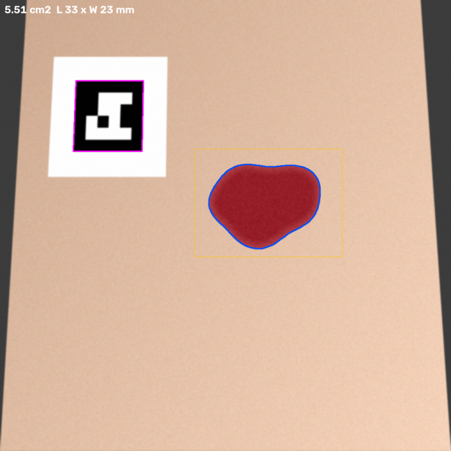

# wound-proto — Phase 0 wound-measurement prototype

Photo + printed marker + a loose box around the wound → **area, perimeter, length, width in millimetres.**

```
python -m wound_proto photo.jpg --box 442,338,777,583 --marker-mm 20 \
    --out result.json --overlay overlay.png
```

<p></p>

This is the Phase 0 from the build plan: prove the pipeline, get two honest numbers,
decide whether to commit to Phase 1. It is **not** a medical device and must not be
used to make clinical decisions.

## What it does

| Stage | How | Why this way |
|---|---|---|
| Scale | Detect an **ArUco marker** of known side length (OpenCV, sub-pixel corners) and build a **homography** from the image plane to a metric plane | A single "pixels per mm" number is wrong the moment the camera tilts; the homography corrects foreshortening. See the table below for how wrong. |
| Boundary | **MobileSAM** (10 M params, CPU ≈ 1–2 s/image) prompted with the user's box, then largest component + hole fill | The size class you would ship on a phone. Box prompts are what a user can give. |
| Measure | Warp the mask into the metric plane, count area, trace the contour for perimeter, convex hull for max-Feret length and perpendicular width | Clinical length × width convention; everything measured *after* rectification. |
| Honesty | If no marker is found, results are pixel-only and `calibrated: false` | It never guesses a scale. |

Two error sources are kept **separable**: calibration + measurement is tested on
synthetic fixtures with exact ground truth; segmentation is tested on FUSeg against
clinician masks. The end-to-end synthetic run stacks them, which is what a user gets.

## Setup

```bash
bash scripts/setup.sh          # clones MobileSAM (+39 MB checkpoint) and the FUSeg dataset
python -m wound_proto.evaluate synth --n 40
python -m wound_proto.evaluate fuseg --root "vendor/wound-segmentation/data/Foot Ulcer Segmentation Challenge"
```

Requires Python ≥ 3.10, `opencv-contrib-python-headless` ≥ 4.8 (works on 5.x), `torch`, `timm`.
No GPU needed.

## Results

### Calibration + measurement — synthetic fixtures, exact ground truth

Perfect mask supplied; only the marker → homography → measurement path is under test.
`naive` is what you get from `pixels × (mm/px)` with no perspective correction.

| Camera tilt | Area error, homography | Area error, naive scale | Length err | Width err |
|---|---|---|---|---|
| 0° | 0.39% | 0.27% | −0.06% | −0.17% |
| 15° | 0.72% | 4.63% | 0.70% | 0.32% |
| 30° | **−0.23%** | **16.15%** | −0.17% | 0.26% |
| 45° | **0.70%** | **38.99%** | 0.70% | 0.42% |

The homography stays under 1% at every tilt. Naive scaling is off by a sixth at
30° and by more than a third at 45° — and 30° is an ordinary handheld angle. This
single table is the case for using a marker-derived homography rather than a ruler.

<!-- SYNTH_SUMMARY -->
**40 fixtures, 20 mm marker, marker detected in 100%.**
Absolute error, mean / p95:

| Tilt | Area, homography (perfect mask) | Area, naive scale | Dice, MobileSAM | Area, end-to-end |
|---|---|---|---|---|
| 0° | 0.36% / 0.62% | 0.37% / 0.48% | 0.987 | 1.96% / 8.57% |
| 15° | 0.43% / 0.79% | 3.67% / 8.71% | 0.978 | 3.59% / 15.59% |
| 30° | 0.64% / 1.14% | 13.98% / 25.16% | 0.994 | 0.84% / 2.51% |
| 45° | 0.72% / 1.24% | 34.70% / 51.19% | 0.993 | 1.18% / 4.42% |
| **all** | **0.54% / 1.14%** | 13.18% / 45.92% | **0.988** | **1.89% / 7.06%** |

Length error 0.48% mean, width 0.61% mean (perfect mask).
The end-to-end column is what a user gets: segmentation error stacked on calibration error.
<!-- /SYNTH_SUMMARY -->

### Segmentation — FUSeg validation split, zero-shot MobileSAM

Box prompt = ground-truth bounding box dilated by up to 15% per side with random
asymmetry, to simulate a user drawing loosely. No fine-tuning of any kind.

**Per wound — one box per ground-truth component.** This is what a user does and is
the number to quote.

<!-- FUSEG_PERWOUND -->
**253 wounds across 195 images** (5 images with empty masks skipped; 38 images hold more than one wound), 0.8 s/image on CPU.

| | mean | median | std | p10 | min |
|---|---|---|---|---|---|
| Dice, raw SAM mask | 0.859 | 0.893 | 0.110 | 0.710 | 0.354 |
| **Dice, after post-processing** | **0.860** | **0.894** | 0.109 | 0.711 | 0.355 |
| IoU, after post-processing | 0.768 | 0.808 | 0.153 | 0.552 | 0.216 |
| Dice, tight GT box (perfect user) | 0.891 | 0.920 | 0.089 | 0.779 | 0.419 |

75% of wounds reach Dice ≥ 0.80; 0.8% fall below 0.50.
For reference, the published *supervised* FUSegNet reaches Dice 0.859 on this benchmark. Zero-shot MobileSAM with a loose box per wound matches it; the tight-box row shows how much a careful user adds.

Overlays (green = clinician mask, blue = prediction, yellow = prompt box) in `results/fuseg-perwound/overlays/`;
worst `0245.png`, median `0946.png`, best `0796.png`.
<!-- /FUSEG_PERWOUND -->

**Per image — one box around the entire mask.** Kept because it is the naive protocol
and it shows a real design constraint (below).

<!-- FUSEG_SUMMARY -->
**195 images** (5 with empty masks skipped), 1.8 s/image on CPU.

| | mean | median | std | p10 | min |
|---|---|---|---|---|---|
| Dice, raw SAM mask | 0.784 | 0.875 | 0.227 | 0.391 | 0.001 |
| **Dice, after post-processing** | **0.781** | **0.871** | 0.233 | 0.391 | 0.001 |
| IoU, after post-processing | 0.689 | 0.771 | 0.254 | 0.243 | 0.000 |
| Dice, tight GT box (perfect user) | 0.833 | 0.919 | 0.205 | 0.530 | 0.000 |

67% of images reach Dice ≥ 0.80; 13.3% fall below 0.50.
This protocol is superseded by the per-wound one above; see *Reading the failures*.

Overlays (green = clinician mask, blue = prediction, yellow = prompt box) in `results/fuseg/overlays/`;
worst `0548.png`, median `0948.png`, best `0796.png`.
<!-- /FUSEG_SUMMARY -->

**Reading the failures.** The worst per-image case (`0548.png`) holds two wounds on two
legs. A single box spanning both is not a wound prompt, so SAM segmented a leg edge and
post-processing then kept the wrong blob. That is a protocol artefact, but it encodes a
product rule: **the app must take one box per wound and never infer a box from a region.**
It also explains why post-processing does not lift the per-image score — "largest
component" deletes legitimate secondary wounds. The remaining low scores are genuine:
faint boundaries under peri-wound erythema, wet wound beds that read as skin, and small
ulcers where a 15% loose box is proportionally huge. The per-wound worst case (`0245.png`,
Dice 0.35) is the last kind: a ~20 × 40 px ulcer beside the little toe on dark skin, where
prediction and clinician mask nearly coincide but a few boundary pixels are most of the
area. Small-wound sensitivity and a Fitzpatrick-stratified evaluation are Phase 1's
first two targets.

Copies of the four instructive overlays are in `results/demo/fuseg-examples/`.

### End-to-end demo

`results/demo/`: a 30°-tilted fixture, ground truth **551.8 mm²**, L 32.4 × W 23.2 mm.

```
area_cm2                    5.512       (551.2 mm²  →  −0.1%)
length_mm                   32.56
width_mm                    23.25
naive_area_mm2              595.42      (what naive scaling would have reported: +7.9%)
perspective_correction_pct  −8.03
sam_score                   0.987
```

## Phase 1 — fine-tuning the segmenter

The plan said "fine-tune a real segmenter (SegFormer-B2 or nnU-Net)". This environment
cannot reach any pretrained backbone, and training one from scratch on 810 images loses
to a distilled SAM encoder, so Phase 1 follows the MedSAM recipe instead, scaled to a CPU:

| | |
|---|---|
| Frozen | MobileSAM image encoder (6.1 M) and prompt encoder — their outputs are precomputed once by `scripts/cache_embeddings.py` (fp16, 2 MB per image) |
| Trained | the mask decoder's single-mask path: 3.5 M parameters (the IoU head and the three unused multi-mask hypernetworks stay as shipped) |
| Data | FUSeg train, 810 images + horizontal flips = 1,620 embeddings; validation 200 images for model selection only |
| Prompt | ground-truth box dilated by up to **20 %** per side at random (the evaluation uses 15 %), so the decoder learns to ignore loose margins |
| Loss | BCE + soft Dice on the 512 × 512 logits, AdamW 1e-4 / wd 0.01, cosine schedule, grad-clip 1.0, batch 8 |
| Output | a full MobileSAM state dict, so `Segmenter(ckpt)`, the CLI and `evaluate.py --ckpt` load it unchanged |

```bash
python scripts/cache_embeddings.py                       # ~1 s/image on 4 cores, once
python -m wound_proto.finetune --out weights/mobile_sam_fuseg.pt
python -m wound_proto.evaluate fuseg --per-wound --ckpt weights/mobile_sam_fuseg.pt \
    --root "vendor/wound-segmentation/data/Foot Ulcer Segmentation Challenge" --out results/fuseg-perwound-ft
```

<!-- FINETUNE -->
<!-- /FINETUNE -->

## Limitations — read before extrapolating

- **Coplanarity.** The homography assumes the wound lies in the marker's plane. On curved
  anatomy (heel, calf, sacrum) that is false, and the error grows with curvature. This is
  the problem depth sensing (LiDAR / ToF) exists for; out of scope here.
- **Synthetic fixtures are generous.** High-contrast wound on plain skin, ideal marker print.
  Real photos have glare, moist wound beds, peri-wound erythema, dressings and hair. The
  FUSeg number is the realistic one for boundaries; the synthetic number isolates the
  geometry.
- **FUSeg is diabetic foot ulcers only.** Pressure injuries, venous leg ulcers, burns and
  surgical wounds are not represented, and public data for them barely exists. Expect the
  zero-shot Dice to drop on those until you have your own labelled images.
- **Skin tone.** The synthetic generator samples five base tones, but FUSeg skews light.
  Any product claim of "works across skin tones" needs a Fitzpatrick-stratified evaluation
  on real images, which this prototype cannot provide.
- **The tilt estimate** reported in `calibration.tilt_deg` is a crude foreshortening ratio for
  display only. Correction comes from the homography, not from that number.
- **Not a medical device.** An app that outputs wound area for clinical use is Software as a
  Medical Device (EU MDR, FDA, CDSCO). Intended use has to be decided before the next line
  of product code.

## What Phase 1 changes

1. Fine-tune a real segmenter (SegFormer-B2 or nnU-Net) on FUSeg + DFUC2022 + AZH, and
   start collecting your own images from day one — public data will not cover your wound
   types.
2. Replace the ArUco square with a purpose-designed sticker (colour patch for white balance,
   known size, patient-safe adhesive) — same maths, better detection under glare.
3. Report **both** errors on every result: mask Dice against a clinician, and area error
   against a ruler. Calibration error compounds on segmentation error.
4. Tissue classification (granulation / slough / necrosis / epithelial) is the long pole
   and has no public data. Build the annotation pipeline first: SAM pre-segments, wound-care
   nurses correct.

## Layout

```
wound_proto/
  calibrate.py   ArUco detection → metric homography; rectify_mask()
  segment.py     MobileSAM box prompt + postprocess()
  measure.py     area / perimeter / length / width, pixel and metric
  synth.py       fixture generator with exact ground truth + perspective warp
  evaluate.py    `fuseg` and `synth` sub-commands
  finetune.py    Phase 1: train the MobileSAM mask decoder on cached FUSeg embeddings
  cli.py         analyse one photo
scripts/setup.sh            fetch MobileSAM + FUSeg (not committed)
scripts/cache_embeddings.py run the frozen image encoder once per FUSeg image -> cache/
scripts/fill_readme.py      render results/*.json into this file
results/         summaries and training log committed; overlays, fixtures, cache and weights are not
```
